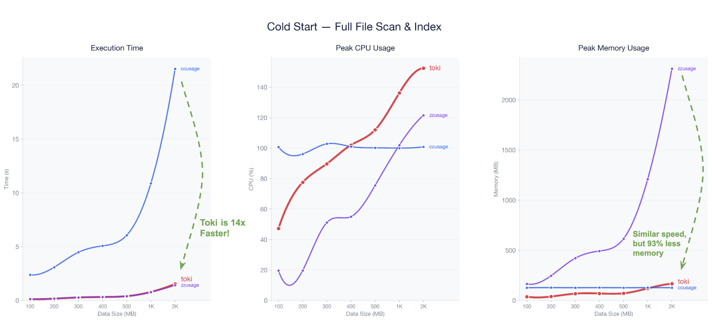
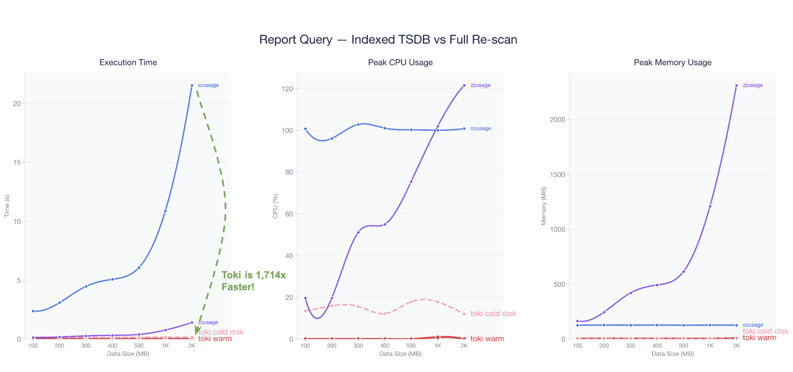

<p align="center">
  
</p>

<h1 align="center">toki</h1>

<p align="center">
  <b>존재감 없는 토큰 사용량 트래커</b><br>
  Rust로 구축. 데몬 기반. idle 5MB. 리포트 7ms. 작업을 전혀 방해하지 않습니다.
</p>

<p align="center">
  <sub><b>toki</b> = <b>to</b>ken <b>i</b>nspector — 발음이 토끼(rabbit)와 비슷합니다. 토끼처럼 빠르고, 토끼처럼 가볍습니다.</sub>
</p>

<p align="center">
  <a href="README.md">🇺🇸 English</a>
</p>

---

> **설계된 소프트웨어입니다.** 바이브 코딩 시대에, toki는 다릅니다 — 모든 아키텍처 결정은 각 구성요소가 왜 필요한지 정확히 아는 전문 시스템 엔지니어가 내렸습니다. TSDB 스키마, rollup-on-write 전략, xxHash3 체크포인트 복구, 4스레드 데몬 모델까지 전부 의도를 가지고 설계하고, 정밀하게 구현했습니다.

---

## 누가 쓰면 좋을까?

- **ccusage 때문에 터미널이 멈추는 분.** toki는 cold start에서 14배, 리포트에서 1,700배 빠릅니다. 2GB 데이터를 조회해도 7ms. 터미널이 멈추는 일은 없습니다.

- **"총 토큰" 이상의 분석이 필요한 분.** 모델별, 세션별, 프로젝트별, 날짜별 분석을 PromQL 스타일 쿼리로 자유롭게. 시간 범위 필터, 다차원 그룹핑, 비용 추적까지 한 줄이면 됩니다.

- **OpenTelemetry 설정이 귀찮은 분.** Collector도, 환경변수도, 설정 파일 수정도 필요 없습니다. toki를 실행하면 이미 디스크에 있는 세션 로그를 바로 읽습니다. 설치 전에 쌓인 수개월치 데이터도 즉시 분석됩니다.

- **여러 AI CLI 도구를 쓰는 분.** Claude Code와 Codex CLI를 하나의 통합 뷰로. `--provider`로 도구별 필터링도 됩니다.

---

## 성능

빠르기만 한 게 아닙니다 — **돌아가고 있는지 눈치채기 어려울 만큼 가볍습니다.** idle 5MB, CPU 0%, 리포트 7ms. ccusage와 zzusage는 물어볼 때마다 전체 파일을 처음부터 다시 읽습니다. toki는 한 번 색인하고, 그 뒤로는 사라집니다.

[ccusage](https://github.com/ryoppippi/ccusage) (Node.js), [zzusage](https://github.com/joelreymont/zzusage) (Zig)와 동일 데이터셋, `sudo purge` 후 측정.

### Cold Start (전체 파일 색인)

ccusage보다 **14배 빠르고**, zzusage와 비슷한 속도에 **메모리는 93% 적습니다**.

> 실제 사용에서는 체크포인트부터 이어서 처리하므로, 새로 쌓인 데이터만 색인합니다.

<p align="center">
  
</p>

<details>
<summary>Cold Start 상세 데이터</summary>

#### 실행 시간

| 데이터 | toki | ccusage | zzusage | toki vs ccusage |
|--------|------|---------|---------|-----------------|
| 100 MB | **0.11s** | 2.38s | 0.13s | **21x** 빠름 |
| 200 MB | **0.16s** | 3.09s | 0.18s | **19x** 빠름 |
| 300 MB | **0.27s** | 4.47s | 0.27s | **16x** 빠름 |
| 400 MB | **0.31s** | 5.07s | 0.32s | **16x** 빠름 |
| 500 MB | **0.39s** | 6.06s | 0.40s | **15x** 빠름 |
| 1 GB | **0.78s** | 10.88s | 0.76s | **14x** 빠름 |
| 2 GB | **1.54s** | 21.53s | 1.41s | **14x** 빠름 |

#### 피크 메모리

| 데이터 | toki | ccusage | zzusage |
|--------|------|---------|---------|
| 100 MB | 37 MB | 126 MB | 165 MB |
| 500 MB | 71 MB | 126 MB | 615 MB |
| 1 GB | 119 MB | 127 MB | 1,209 MB |
| 2 GB | 166 MB | 126 MB | **2,311 MB** |

> **zzusage와 속도가 비슷한데 의미가 있나?** toki는 라인마다 더 많은 일을 합니다 — TSDB 쓰기, rollup 집계, 체크포인트 저장, JSON 스키마 검증. zzusage는 이걸 전부 생략하고 순수 파싱만 합니다. 그런데도 wall-clock 시간은 거의 같습니다. 그리고 zzusage는 구조 검사가 없어서, 조작된 JSONL로 사용량을 위조하는 게 가능합니다. toki는 TSDB에 넣기 전에 전부 검증합니다.

</details>

### 리포트 속도 (색인 TSDB 조회 vs 전체 재스캔)

toki report는 데이터 크기와 무관하게 **~7ms**. 2GB 기준 ccusage보다 **1,742배** 빠릅니다.

<p align="center">
  
</p>

<details>
<summary>리포트 상세 데이터</summary>

#### 실행 시간

| 데이터 | toki (warm) | toki (cold disk) | ccusage | zzusage | warm vs ccusage | warm vs zzusage |
|--------|-------------|-----------------|---------|---------|-----------------|-----------------|
| 100 MB | **0.007s** | 0.16s | 2.38s | 0.13s | **358x** | **20x** |
| 200 MB | **0.007s** | 0.15s | 3.09s | 0.18s | **435x** | **25x** |
| 300 MB | **0.007s** | 0.15s | 4.47s | 0.27s | **602x** | **37x** |
| 400 MB | **0.008s** | 0.14s | 5.07s | 0.32s | **658x** | **41x** |
| 500 MB | **0.008s** | 0.16s | 6.06s | 0.40s | **785x** | **51x** |
| 1 GB | **0.009s** | 0.15s | 10.88s | 0.76s | **1,153x** | **81x** |
| 2 GB | **0.012s** | 0.17s | 21.53s | 1.41s | **1,742x** | **114x** |

#### 피크 메모리

| 데이터 | toki (warm) | toki (cold disk) | ccusage | zzusage |
|--------|-------------|-----------------|---------|---------|
| 100 MB | 5 MB | 8 MB | 126 MB | 165 MB |
| 500 MB | 5 MB | 8 MB | 126 MB | 615 MB |
| 1 GB | 5 MB | 8 MB | 127 MB | 1,209 MB |
| 2 GB | **10 MB** | 10 MB | 126 MB | **2,311 MB** |

#### 피크 CPU

| 데이터 | toki (warm) | toki (cold disk) | ccusage | zzusage |
|--------|-------------|-----------------|---------|---------|
| 100 MB | 0% | 14% | 101% | 20% |
| 500 MB | 0% | 18% | 100% | 76% |
| 1 GB | 1% | 18% | 100% | 102% |
| 2 GB | 0% | 12% | 101% | 122% |

</details>

### Idle 상태

cold start가 끝나면 toki는 시스템에서 사라집니다.

| CPU | 메모리 | DB 크기 |
|-----|--------|---------|
| **~0%** | **5 MB** | **세션 데이터의 ~3%** (2GB 세션 → 64MB TSDB) |

- **toki** — rayon 병렬 처리 + mmap zero-copy + 파일별 스트리밍. cold start가 끝나면 5MB, CPU 0%로 내려갑니다. FSEvents(커널 레벨, 폴링 없음)로 감시하고, 새 로그가 쓰일 때만 깨어납니다.
- **ccusage** — 파일 하나씩 동기 블로킹. 매번 전체 파일을 순서대로 읽는 동안 터미널이 멈춥니다.
- **zzusage** — 모든 이벤트를 메모리에 올린 뒤 처리. 2GB면 2.3GB RAM. 더 크면 OOM.

idle 상태가 있는 건 toki뿐입니다. 나머지는 실행할 때마다 전체 비용을 지불합니다.

> 측정 환경: Apple M1 MacBook Air (8GB RAM), macOS, 절전 모드 off.
> 재현: `sudo -v && python3 benches/benchmark.py run --purge --tool all`

---

## 동작 방식

Docker처럼 데몬/클라이언트 구조로 동작합니다:

```
toki daemon start     # 항상 실행되는 서버   (≈ dockerd)
toki trace            # 실시간 스트림        (≈ docker logs -f)
toki report           # 즉시 TSDB 조회      (≈ docker ps)
```

- **daemon** — 설정된 provider(Claude Code, Codex CLI)의 세션 로그를 FSEvents로 감시하고, 이벤트를 파싱해서 provider별 내장 TSDB(fjall)에 기록합니다. trace 클라이언트가 없으면 Sink 오버헤드는 0입니다.
- **trace** — UDS로 데몬에 연결해서 실시간 이벤트 스트림을 받습니다. `print`, `uds://`, `http://` 모든 sink을 지원합니다.
- **report** — UDS로 데몬에 쿼리를 보내고, 모든 provider TSDB의 결과를 병합하여 받습니다. 언제나 빠르고, 언제나 색인된 상태입니다. `--provider`로 단일 provider만 조회할 수도 있습니다.

---

## Quick Start

```bash
# 빌드
cargo build --release
# 바이너리: target/release/toki — PATH에 추가하거나 직접 실행

# 0. Provider 설정 (최초 실행 전 필수)
toki settings set providers --add claude_code
toki settings set providers --add codex    # 선택: Codex CLI 지원 추가
toki settings get providers                 # 활성화된 provider 확인

# 1. 데몬 시작 (기본 백그라운드 실행)
toki daemon start

# 2. 다른 터미널에서 실시간 이벤트 스트림
toki trace

# 3. 리포트 조회 (TSDB에서 즉시 조회)
toki report                                   # 전체 provider 병합
toki report --provider claude_code            # 단일 provider
toki report daily --since 20260301
toki report monthly

# 4. PromQL 스타일 쿼리
toki report query 'usage{model="claude-opus-4-6"}[1h] by (model)'
toki report query 'usage{provider="codex"} by (model)'
toki report query 'sessions{project="myapp"}'
```

---

## 명령어

### Daemon

```bash
toki daemon start       # 데몬 시작 (백그라운드)
toki daemon start --foreground  # 포그라운드 실행 (디버그용)
toki daemon stop        # 데몬 중지
toki daemon restart     # 중지 + 재시작 (설정 변경 반영)
toki daemon status      # 실행 상태 확인
toki daemon reset       # DB 전체 삭제 + 초기화
```

### Report

```bash
# 전체 요약
toki report                                         # 전체 provider
toki report --provider claude_code                  # 단일 provider
toki report --since 20260301 --until 20260331

# 시간별 그룹핑
toki report daily --since 20260301
toki report weekly --since 20260301 --start-of-week tue
toki report monthly
toki report yearly
toki report hourly --from-beginning

# 세션/프로젝트 필터
toki report --group-by-session
toki report --project toki
toki report --session-id 4de9291e

# Provider 필터
toki report --provider codex daily --since 20260301

# PromQL 스타일 쿼리
toki report query 'usage{model="claude-opus-4-6"}[1h] by (model)'
toki report query 'usage{provider="codex"} by (model)'
toki report query 'usage{session="4de9", since="20260301"} by (session)'
toki report query 'sessions{project="myapp"}'
toki report query 'projects'

# 옵션
toki -z Asia/Seoul report daily --since 20260301   # 타임존 지정
toki --no-cost report                               # 비용 표시 없이
```

<details>
<summary>리포트 옵션 레퍼런스</summary>

| 옵션 | 설명 |
|------|------|
| *(서브커맨드 없음)* | 전체 총합 (`--since`/`--until` 선택적) |
| `daily\|weekly\|monthly\|yearly\|hourly` | 시간별 그룹핑 |
| `query '<PROMQL>'` | PromQL 스타일 자유 쿼리 |
| `--since YYYYMMDD[hhmmss]` | 시작 시점 (inclusive, `>=`) |
| `--until YYYYMMDD[hhmmss]` | 종료 시점 (inclusive, `<=`) |
| `--from-beginning` | `--since` 없이 전체 그룹핑 허용 |
| `--group-by-session` | 세션별 그룹핑 (시간 서브커맨드와 동시 사용 불가) |
| `--session-id <PREFIX>` | 세션 UUID 접두사 필터 |
| `--project <NAME>` | 프로젝트 디렉토리 서브스트링 필터 |
| `--provider <NAME>` | provider 필터 (`claude_code`, `codex`) |
| `--start-of-week mon\|tue\|...\|sun` | `weekly`에서만 사용 |

</details>

<details>
<summary>PromQL 쿼리 문법</summary>

```
metric{filters}[bucket] by (dimensions)
```

| 요소 | 설명 | 예시 |
|------|------|------|
| metric | `usage`, `sessions`, `projects` | `usage` |
| filters | `key="value"` 쌍, `,`로 구분 | `{model="claude-opus-4-6", since="20260301"}` |
| bucket | 시간 버킷 (s/m/h/d/w) | `[1h]`, `[5m]`, `[1d]` |
| dimensions | 그룹 기준 (model/session/project) | `by (model, session)` |

필터 키: `model`, `session`, `project`, `provider`, `since`, `until`

</details>

### Trace

```bash
toki trace                                              # 기본 (터미널 출력)
toki trace --sink print --sink http://localhost:8080     # 멀티 싱크
```

### Settings

```bash
toki settings                                  # TUI 열기 (cursive)
toki settings set claude_code_root /path       # 개별 설정 변경
toki settings set providers --add claude_code  # Provider 추가
toki settings set providers --add codex        # Provider 추가
toki settings set providers --remove codex     # Provider 제거
toki settings get providers                     # Provider 목록 + 상태 확인
toki settings get timezone                     # 설정 조회
toki settings list                             # 전체 설정 출력
```

<details>
<summary>설정 레퍼런스</summary>

| 설정 항목 | 설명 | 기본값 |
|-----------|------|--------|
| Providers | 활성화된 provider (`toki settings set providers --add/--remove`로 관리) | `[]` |
| Claude Code Root | Claude Code 루트 디렉토리 | `~/.claude` |
| Daemon Socket | 데몬 UDS 소켓 경로 | `~/.config/toki/daemon.sock` |
| Timezone | IANA 타임존 (빈값=UTC) | *(없음)* |
| Output Format | 기본 출력 형식 | `table` |
| Start of Week | 주간 리포트 시작 요일 | `mon` |
| No Cost | 비용 계산 비활성화 | `false` |
| Retention Days | 이벤트 보존 기간 (0=무제한) | `0` |
| Rollup Retention Days | Rollup 보존 기간 (0=무제한) | `0` |

우선순위: **CLI 인자 > settings.json > 기본값**

</details>

### 클라이언트 옵션 (trace / report)

| 옵션 | 설명 |
|------|------|
| `--output-format table\|json` | 출력 형식 오버라이드 |
| `--sink <SPEC>` | 출력 대상, 복수 지정 가능 |
| `--timezone <IANA>` / `-z` | 타임존 오버라이드 |
| `--no-cost` | 비용 계산 비활성화 |

---

## 지원 Provider

| Provider | CLI 도구 | 데이터 형식 | 상태 |
|----------|---------|-------------|------|
| `claude_code` | [Claude Code](https://claude.ai/code) | JSONL (append-only) | 지원 |
| `codex` | [Codex CLI](https://github.com/openai/codex) | JSONL (append-only) | 지원 |
| *(gemini)* | [Gemini CLI](https://github.com/google-gemini/gemini-cli) | JSON (full rewrite) | 예정 |

각 provider는 독립된 데이터베이스(`~/.config/toki/<provider>.fjall`)를 가집니다. 리포트는 기본적으로 모든 활성 provider의 결과를 병합하며, `--provider`로 단일 provider만 필터링할 수 있습니다.

---

## 문서

| 문서 | 설명 |
|------|------|
| **[아키텍처 & 설계](docs/DESIGN.ko.md)** | 데몬 스레드, TSDB 스키마, rollup 전략, 체크포인트 복구, 데이터 흐름 |
| **[사용법 가이드](docs/USAGE.ko.md)** | 상세 명령어 레퍼런스, 출력 형식, 라이브러리 API, 예제 |
| **[JSONL 형식 레퍼런스](docs/claude-code-jsonl-format.ko.md)** | Claude Code JSONL 구조, 라인 타입, 파싱 최적화 |
| **[벤치마크 상세](benches/COMPARISON.ko.md)** | 전체 비교 방법론, 아키텍처 분석, 스케일링 예측 |
| **[Codex CLI 분석](docs/codex-cli-analysis.md)** | Codex CLI 로컬 데이터 형식, 토큰 구조, 파싱 전략 |
| **[Gemini CLI 분석](docs/gemini-cli-analysis.md)** | Gemini CLI 로컬 데이터 형식 분석 (향후 provider) |
| **[왜 OpenTelemetry가 아닌가?](docs/why-not-otel.md)** | toki가 OTEL 데이터 대신 로컬 파일을 파싱하는 이유 |
| **[OTEL 비교](docs/otel-comparison.md)** | OpenTelemetry 구현 상세: Claude Code vs Gemini CLI vs toki |

---

## 비용 계산

모든 출력에 모델별 추정 비용(USD)이 포함됩니다. 가격 데이터는 [LiteLLM](https://github.com/BerriAI/litellm) 커뮤니티 가격표에서 가져옵니다.

- **최초 실행**: LiteLLM JSON 다운로드 → Claude + OpenAI 모델 가격 추출 → 파일 캐시 (`~/.config/toki/pricing.json`)
- **이후 실행**: HTTP ETag 조건부 요청 → 변경 없으면 304 (바디 없이 ~50ms)
- **오프라인**: 캐시된 데이터로 동작합니다. 캐시가 없으면 Cost 컬럼이 생략됩니다.
- **`--no-cost`**: 가격 fetch를 건너뜁니다.

---

## 프라이버시 & 보안

toki는 정책이 아닌 **아키텍처로 프라이버시를 보장**하도록 설계되었습니다.

- **프롬프트 접근 없음**: toki의 JSONL 파서는 `"assistant"` 타입 줄만 역직렬화하고, `usage` 객체(토큰 수)와 `model` 필드만 추출합니다. 사용자 프롬프트, 어시스턴트 응답, 파일 내용, thinking 블록은 **메모리에 절대 로드되지 않습니다** — serde가 힙 할당 없이 건너뜁니다.
- **데이터 네트워크 전송 없음**: 모든 처리는 로컬에서 이루어집니다. toki는 데이터를 어디에도 보내지 않습니다. 유일한 외부 요청은 공개 LiteLLM 레포지토리에서 가격표를 가져오는 선택적 요청뿐입니다 (`--no-cost`로 비활성화).
- **대화 내용 로깅 없음**: TSDB에는 타임스탬프, 모델명, 세션 ID, 소스 파일 경로, 4개의 토큰 수 정수만 저장됩니다. 그 외에는 아무것도 없습니다.
- **읽기 전용 접근**: toki는 세션 파일을 읽기만 합니다. CLI 도구의 데이터를 수정, 쓰기, 삭제하지 않습니다.

이는 OpenTelemetry 기반 모니터링과 근본적으로 다릅니다. OTEL SDK는 CLI 프로세스 내부에서 실행되며, 설정에 따라 프롬프트, 도구 호출, API 요청 본문이 로그 이벤트에 포함될 수 있습니다. toki는 외부에서 동작하며 파싱 대상으로 선택한 것만 봅니다 — 그것은 엄밀히 토큰 메타데이터뿐입니다.

---

## 기술 스택

| 용도 | 선택 | 근거 |
|------|------|------|
| DB | fjall 3.x | Pure Rust LSM-tree, TSDB keyspace 구조에 적합 |
| 동시성 | std::thread + crossbeam-channel | 런타임 충돌 없음, 라이브러리 안전 |
| 병렬 스캔 | rayon | cold start 세션 파일 병렬 처리 |
| 파일 감시 | notify 6.x | macOS FSEvents 자동 사용 |
| 직렬화 | bincode (DB), serde_json (JSONL) | 바이너리 최소 오버헤드 |
| 해시 | xxhash-rust 0.8 (xxh3) | 체크포인트 줄 식별 (30GB/s) |
| HTTP | ureq 2.x | 동기 HTTP, ETag 조건부 요청 |
| CLI | clap 4.x | 서브커맨드, 글로벌 옵션 지원 |
| 테이블 | comfy-table 7.1 | Unicode 테이블 렌더링 |
| IPC | Unix Domain Socket | 데몬-클라이언트 NDJSON 스트리밍 |

---

## 프로젝트 구조

```
src/
├── lib.rs                          # Public API: start(), Handle
├── main.rs                         # CLI 바이너리 (clap)
├── config.rs                       # Config + 파일 기반 설정
├── db.rs                           # fjall 래퍼 (7 keyspaces)
├── engine.rs                       # TrackerEngine: cold_start + watch_loop
├── writer.rs                       # DB writer thread (DbOp channel)
├── query.rs                        # TSDB 쿼리 엔진 (report용)
├── query_parser.rs                 # PromQL 스타일 쿼리 파서
├── retention.rs                    # 데이터 보존 정책
├── checkpoint.rs                   # 역순 라인 스캔, xxHash3 매칭
├── pricing.rs                      # LiteLLM 가격 fetch, ETag 캐싱
├── settings.rs                     # Cursive TUI 설정 페이지
├── common/
│   ├── types.rs                    # 공통 타입, trait 정의
│   └── time.rs                     # 고속 타임스탬프 파서 (0.1µs)
├── daemon/                         # 데몬 서버 컴포넌트
│   ├── broadcast.rs                # BroadcastSink (zero-overhead fan-out)
│   ├── listener.rs                 # UDS accept loop + multi-DB 쿼리 병합
│   └── pidfile.rs                  # PID 파일 관리
├── sink/                           # 출력 추상화 (Sink trait)
│   ├── print.rs                    # PrintSink (table/json → stdout)
│   ├── uds.rs                      # UdsSink (NDJSON → UDS)
│   └── http.rs                     # HttpSink (JSON POST)
├── providers/                      # provider별 파서 (Provider trait)
│   ├── mod.rs                      # Provider trait, FileParser trait, registry
│   ├── claude_code/                # Claude Code JSONL 파서
│   │   ├── mod.rs                  # ClaudeCodeProvider impl
│   │   └── parser.rs              # 세션 디스커버리 + 라인 파싱
│   └── codex/                      # Codex CLI JSONL 파서
│       ├── mod.rs                  # CodexProvider impl
│       └── parser.rs              # Stateful 파서 (model tracking)
└── platform/macos/mod.rs           # macOS FSEvents 감시
```

---

## 라이선스

[FSL-1.1-Apache-2.0](LICENSE)
