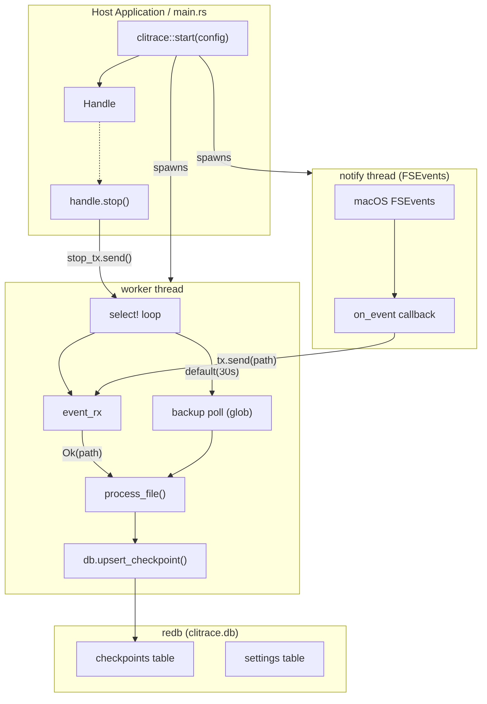
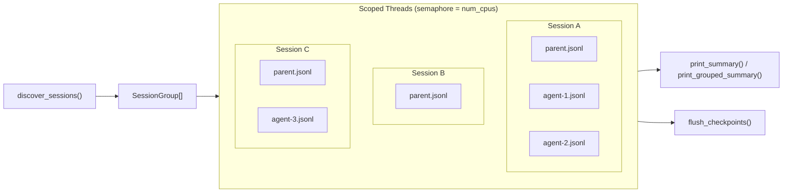
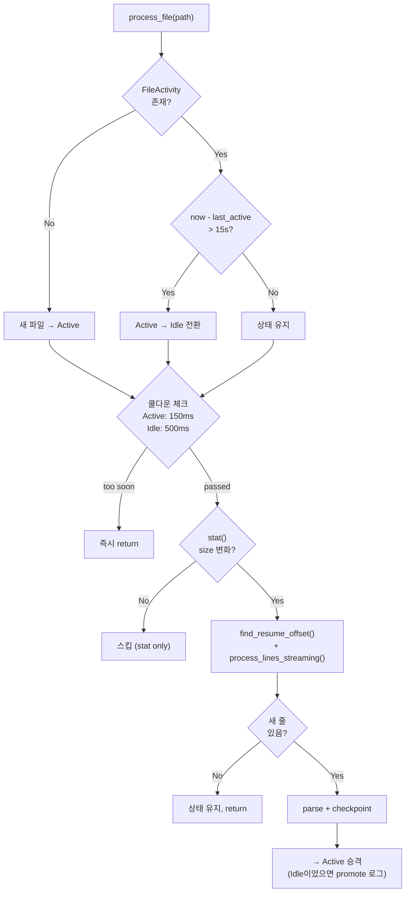
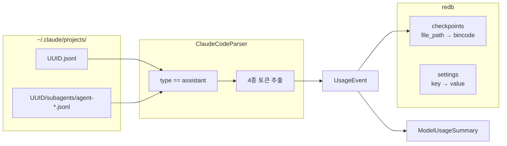

# clitrace

Claude Code CLI의 JSONL 세션 로그를 파일 시스템 이벤트 기반으로 감시하여, 모델별 토큰 사용량을 실시간 추적하는 Rust 라이브러리 모듈.

## Quick Start

### 바이너리로 실행

```bash
cd module/clitrace
cargo run --release -- trace
```

기본 설정으로 `~/.claude/projects/` 스캔 후 watch mode 진입.
`trace` 모드는 동일 DB 경로 기준 단일 인스턴스만 허용한다.
전체 재스캔이 필요하면 `--full-rescan`을 사용한다.

```bash
# 시작 시 일별 그룹핑으로 요약 출력
cargo run --release -- trace --startup-group-by day

# 시작 시 시간별 그룹핑 (체크포인트 필수, --full-rescan 불가)
cargo run --release -- trace --startup-group-by hour
```

Trace 옵션:
- `--startup-group-by hour|day|week|month|year`: cold start 시 시간 단위 그룹핑 요약
  - `hour`는 기존 체크포인트가 있어야 사용 가능 (증분 데이터만 출력)
  - `hour`는 `--full-rescan`과 함께 사용 불가

### Report 모드 (one-shot)

```bash
cargo run --release -- report
cargo run --release -- report --since 20260301
cargo run --release -- report --since 20260301 --until 20260331
cargo run --release -- report monthly
cargo run --release -- report monthly --since 20260301
cargo run --release -- report yearly
cargo run --release -- report daily --since 20260301
cargo run --release -- report daily --from-beginning
cargo run --release -- report weekly --since 20260301 --start-of-week tue
cargo run --release -- report hourly --since 20260301
cargo run --release -- report hourly --from-beginning
```

Report 옵션:
- 서브커맨드 없이 실행하면 전체 총합 출력 (`--since`/`--until` 선택적)
- 서브커맨드: `daily | weekly | monthly | yearly | hourly`
  - `hourly`, `daily`, `weekly`는 `--since` 또는 `--from-beginning` 필수
  - `monthly`, `yearly`는 제한 없음
  - `--start-of-week`는 `weekly`에서만 사용 가능
- `--since` (inclusive, UTC, `>=`): `YYYYMMDD` 또는 `YYYYMMDDhhmmss`
  - `YYYYMMDD`는 해당 날짜의 `00:00:00` UTC로 해석
- `--until` (inclusive, UTC, `<=`): `YYYYMMDD` 또는 `YYYYMMDDhhmmss`
  - `YYYYMMDD`는 해당 날짜의 `23:59:59` UTC로 해석
- `--from-beginning`: `--since` 없이 전체 데이터 그룹핑 허용

### 환경변수 오버라이드

```bash
CLITRACE_CLAUDE_ROOT=/path/to/custom/.claude cargo run --release -- trace
CLITRACE_DB_PATH=/path/to/custom.db cargo run --release -- trace
CLITRACE_DEBUG=1 cargo run --release -- trace   # 디버그 로그 (상태 전이, 이벤트, 타이밍)
CLITRACE_DEBUG=2 cargo run --release -- trace   # 레벨 1 + verbose (size unchanged, no new lines 스킵 로그)
```

### 라이브러리로 사용

```toml
# Cargo.toml
[dependencies]
clitrace = { path = "../module/clitrace" }
```

```rust
use clitrace::{Config, start};

fn main() {
    let config = Config::new()
        .with_claude_root("/custom/path/.claude".to_string());

    let handle = start(config, None).expect("Failed to start clitrace");

    // ... 호스트 애플리케이션 로직 ...

    handle.stop(); // 또는 handle이 drop되면 자동 종료
}
```

## 출력 예시

### Cold Start (모델별 요약)

```
[clitrace] ═══════════════════════════════════════════
[clitrace] Token Usage Summary
[clitrace] ───────────────────────────────────────────
[clitrace] Model: claude-opus-4-6
[clitrace]   Input:        1,234 | Cache Create:       56,789
[clitrace]   Cache Read:  98,765 | Output:              4,321
[clitrace]   Events: 42
[clitrace] ───────────────────────────────────────────
[clitrace] Model: claude-haiku-4-5-20251001
[clitrace]   Input:          567 | Cache Create:       12,345
[clitrace]   Cache Read:  34,567 | Output:              2,100
[clitrace]   Events: 18
[clitrace] ═══════════════════════════════════════════
```

### Watch Mode (실시간 이벤트)

```
[clitrace] claude-opus-4-6 | session.jsonl | in:3 cc:5139 cr:9631 out:14
```

## Architecture

### Thread Model



### Cold Start 병렬 처리



### Active/Idle 파일 분류 & 체크포인트

macOS FSEvents가 디렉토리 내 파일 하나가 변해도 같은 디렉토리의 모든 파일에 이벤트를 발생시키므로, 파일별 active/idle 상태를 추적하여 불필요한 처리를 최소화한다.



| 상수 | 값 | 역할 |
|------|----|------|
| `ACTIVE_COOLDOWN` | 150ms | Active 파일 재처리 최소 간격 |
| `IDLE_COOLDOWN` | 500ms | Idle 파일 stat() 최소 간격 |
| `IDLE_TRANSITION` | 15s | 새 줄 없이 경과 시 Idle로 전환 |

**파일 크기 기반 fast skip**:
- watch 이벤트 수신 시 `stat()`으로 파일 크기만 확인 (파일 open/read 없음)
- 크기 변화 없으면 즉시 스킵 (~1-5µs vs 기존 ~150-300µs)
- JSONL 특성상 새 줄 추가 = 크기 증가, compaction = 크기 감소이므로 false negative 없음

**역순 스캔 알고리즘**:
- 파일 끝에서 4KB 청크 단위로 역순 읽기
- 라인 길이 pre-filter (O(1) 정수 비교, ~85% 후보 제거)
- 길이 일치 시에만 xxHash3-64 비교 (30GB/s)
- 청크 경계를 넘는 라인은 fragment 누적으로 처리
- Compaction으로 바이트 위치가 변해도 라인 해시로 복구

### 데이터 흐름



## Data Model

### UsageEvent

| 필드 | 타입 | 설명 |
|------|------|------|
| `event_key` | String | `{message.id}:{timestamp}` |
| `source_file` | String | 원본 JSONL 파일 경로 |
| `model` | String | `claude-opus-4-6` 등 |
| `input_tokens` | u64 | 캐시 미적용 입력 토큰 |
| `cache_creation_input_tokens` | u64 | 캐시 생성 입력 토큰 |
| `cache_read_input_tokens` | u64 | 캐시 읽기 입력 토큰 |
| `output_tokens` | u64 | 출력 토큰 |

### FileCheckpoint

| 필드 | 타입 | 설명 |
|------|------|------|
| `file_path` | String | JSONL 파일 절대 경로 (key) |
| `last_line_len` | u64 | 마지막 처리 줄의 바이트 길이 (pre-filter용) |
| `last_line_hash` | u64 | 마지막 처리 줄의 xxHash3-64 해시 |

### Config

| 필드 | 타입 | 기본값 | 설명 |
|------|------|--------|------|
| `claude_code_root` | String | `~/.claude` | 루트 디렉토리 |
| `db_path` | PathBuf | `~/.config/clitrace/clitrace.db` | DB 파일 경로 |
| `full_rescan` | bool | false | 시작 시 체크포인트 초기화 |

설정 우선순위: **환경변수** > **DB settings 테이블** > **기본값**

## Project Structure

```
module/clitrace/
├── Cargo.toml
├── README.md
├── src/
│   ├── lib.rs                          # Public API: start(), Handle, Config
│   ├── main.rs                         # 참조 바이너리 (Ctrl+C 핸들링)
│   ├── config.rs                       # Config + 환경변수/DB 우선순위
│   ├── db.rs                           # redb 래퍼 (checkpoints + settings)
│   ├── engine.rs                       # TrackerEngine: cold_start + watch_loop
│   ├── checkpoint.rs                   # 역순 라인 스캔, xxHash3 매칭, JSON 완성도 검사
│   ├── common/
│   │   ├── mod.rs
│   │   └── types.rs                    # UsageEvent, FileCheckpoint, LogParser trait
│   ├── providers/
│   │   ├── mod.rs
│   │   ├── claude_code/
│   │   │   ├── mod.rs
│   │   │   └── parser.rs              # JSONL 파싱 + 세션 디스커버리
│   │   ├── gemini/
│   │   │   └── mod.rs                 # TODO
│   │   └── codex/
│   │       └── mod.rs                 # TODO
│   └── platform/
│       ├── mod.rs                     # create_watcher(), watch_directory()
│       ├── macos/mod.rs               # macOS 기본 경로
│       ├── windows/mod.rs             # TODO
│       └── linux/mod.rs               # TODO
└── tests/                             # 58+ unit tests (cargo test)
```

## Tech Stack

| 용도 | 선택 | 근거 |
|------|------|------|
| DB | redb 2.x | Pure Rust, C 의존성 없음, key-value에 적합 |
| 동시성 | std::thread + crossbeam-channel | 런타임 충돌 없음, 라이브러리 안전 |
| 파일 감시 | notify 6.x | macOS FSEvents 자동 사용 |
| 직렬화 | bincode 1.x (checkpoint), serde_json (JSONL) | 바이너리 최소 오버헤드 |
| 해시 | xxhash-rust 0.8 (xxh3) | 체크포인트 줄 식별 (30GB/s, 비암호화) |

## JSONL 구조 참고

Claude Code는 `~/.claude/projects/<encoded-path>/` 하위에 세션 로그를 저장한다.

```
~/.claude/projects/-Users-user-Documents-project/
├── 4de9291e-061e-414a-85cb-de615826aded.jsonl        # 부모 세션
├── 4de9291e-061e-414a-85cb-de615826aded/
│   └── subagents/
│       └── agent-aed1da92cc2e4e9e7.jsonl             # 서브에이전트
└── db7cd31e-fdb1-4767-a6a2-f2f3dc68a74b.jsonl        # 다른 세션
```

JSONL 줄 타입:
- `file-history-snapshot` — 무시
- `user` — 무시
- **`assistant`** — 파싱 대상 (`message.usage`에 4종 토큰)

서브에이전트 토큰은 부모에 포함되지 않으며 별도 파일에 기록된다 (전체의 ~16%).
