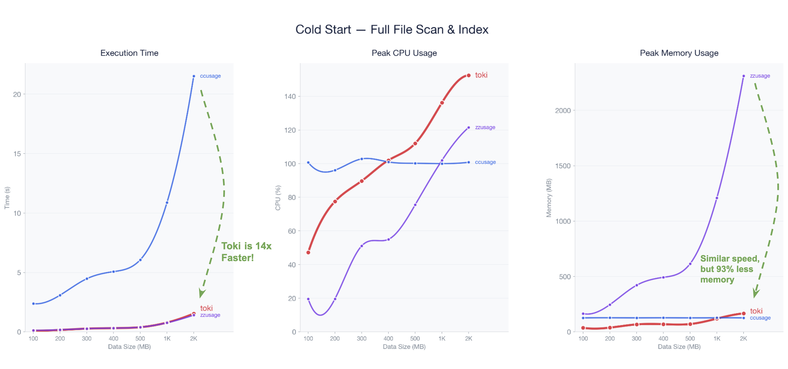
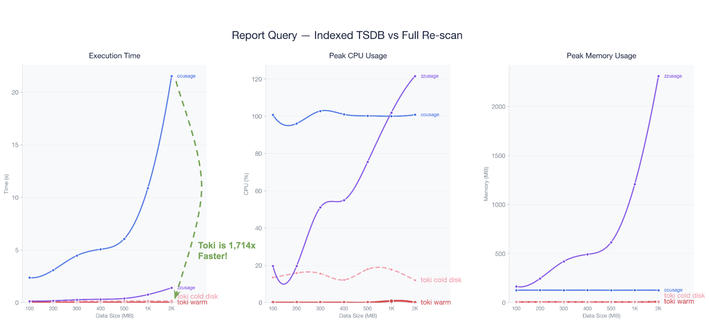

<p align="center">
  
</p>

<h1 align="center">toki</h1>

<p align="center">
  <b>Token usage tracker for Claude Code and Codex CLI</b><br>
  Built in Rust. Daemon-powered. Incremental by design. Your workflow stays responsive.
</p>

<p align="center">
  <sub><b>toki</b> = <b>to</b>ken <b>i</b>nspector — sounds like <i>tokki</i> (토끼, rabbit in Korean). Fast and light, just like one.</sub>
</p>

<p align="center">
  <a href="README.ko.md">🇰🇷 한국어</a>
</p>

<p align="center">
  <em>Not just vibe-coded — carefully architected by a professional developer.</em>
</p>

<p align="center">
  
</p>

> **Looking for a GUI?** [Toki Monitor](https://github.com/korjwl1/toki-monitor) is a macOS menu bar app with a real-time dashboard, animated rabbit indicator, and anomaly alerts — built on the toki daemon.

> **Multi-device sync?** [Toki Sync Server](https://github.com/korjwl1/toki-sync) aggregates token usage across all your devices. Self-hosted, works with the built-in `toki settings sync` commands.

---

## Table of contents

- [Quick start](#quick-start)
- [Who is this for](#who-is-this-for)
- [How it works](#how-it-works)
- [Performance](#performance)
- [Privacy and security](#privacy-and-security)
- [Commands](#commands)
- [Multi-device sync](#multi-device-sync)
- [Cost calculation](#cost-calculation)
- [Supported providers](#supported-providers)
- [Planned features](#planned-features)
- [Sponsor](#sponsor)
- [License](#license)

---

## Quick start

Get from install to first report in 30 seconds:

```bash
# 1. Install (macOS or Linux with Homebrew)
brew tap korjwl1/tap
brew install toki

# 2. Start the daemon (auto-detects ~/.claude and ~/.codex)
toki daemon start

# 3. See your usage
toki report
```

For more commands (trace, PromQL queries, time grouping, remote sync), jump to [Commands](#commands) below or read the [Usage Guide](docs/USAGE.md).

---

## Who is this for

toki fits four common situations:

- Your terminal freezes on every token report. toki is 14x faster on cold start and 1,700x faster on reports. Even 2 GB of data comes back in 7 ms.
- You need more than "total tokens". Per-model, per-session, per-project, per-day breakdowns with PromQL-style queries. Filter by time range, group by any dimension, track costs — all in one command.
- You do not want to set up OpenTelemetry. No collector, no config files, no environment variables. Install toki, run it, done. It reads your existing session files directly — including months of history from before you installed it.
- You use multiple AI CLI tools. toki tracks Claude Code and Codex CLI in a single unified view. Filter by `--provider` when you need a per-tool breakdown.

---

## How it works

Docker-like daemon/client architecture:

```text
toki daemon start     # always-on server   (≈ dockerd)
toki trace            # real-time stream    (≈ docker logs -f)
toki report           # instant TSDB query  (≈ docker ps)
```

- **daemon** — watches session logs from configured providers (Claude Code, Codex CLI), parses events, writes to per-provider embedded TSDBs (fjall), tracks rate-limit windows, and optionally syncs data. Writer and sync workers are created per enabled provider; optional poller/backfill workers run only when their features are enabled.
- **trace** — connects to the daemon over UDS for real-time JSONL event streaming. Supports multiple sinks (`--sink uds://`, `--sink http://`) for relaying to other services.
- **report** — sends a query to the daemon and receives one result set per provider DB. Provider-specific token columns stay separate; use `--provider` to query only one.

---

## Performance

In the benchmark snapshot below, toki sat at 5 MB idle with near-zero CPU and answered the measured report workload in about 7 ms. Most alternatives re-read source JSONL from scratch on every invocation; toki reads its indexed event database instead.

Benchmarked against [ccusage](https://github.com/ryoppippi/ccusage) (Node.js) and [zzusage](https://github.com/joelreymont/zzusage) (Zig) on the same dataset, disk cache purged before each run.

### Cold start (full index build)

14x faster than ccusage, similar speed to zzusage but with **93% less memory**.

> In normal operation, toki resumes from its last checkpoint — only new data gets indexed.

<p align="center">
  
</p>

<details>
<summary>Cold start detailed data</summary>

#### Execution time

| Data size | toki | ccusage | zzusage | toki vs ccusage |
|-----------|------|---------|---------|-----------------|
| 100 MB | **0.11 s** | 2.38 s | 0.13 s | **21x** faster |
| 200 MB | **0.16 s** | 3.09 s | 0.18 s | **19x** faster |
| 300 MB | **0.27 s** | 4.47 s | 0.27 s | **16x** faster |
| 400 MB | **0.31 s** | 5.07 s | 0.32 s | **16x** faster |
| 500 MB | **0.39 s** | 6.06 s | 0.40 s | **15x** faster |
| 1 GB | **0.78 s** | 10.88 s | 0.76 s | **14x** faster |
| 2 GB | **1.54 s** | 21.53 s | 1.41 s | **14x** faster |

#### Peak memory

| Data size | toki | ccusage | zzusage |
|-----------|------|---------|---------|
| 100 MB | 37 MB | 126 MB | 165 MB |
| 200 MB | 38 MB | 127 MB | 246 MB |
| 300 MB | 67 MB | 127 MB | 421 MB |
| 400 MB | 69 MB | 127 MB | 492 MB |
| 500 MB | 71 MB | 126 MB | 615 MB |
| 1 GB | 119 MB | 127 MB | 1,209 MB |
| 2 GB | 166 MB | 126 MB | **2,311 MB** |

> Why does matching zzusage matter? toki does strictly more work per line — event/index writes, checkpoint persistence, deduplication, and schema validation. zzusage skips all of this. Despite the extra workload, toki matches zzusage in this benchmark.

</details>

### Report speed in the recorded benchmark (indexed event DB vs source re-scan)

About 7 ms on these datasets — **1,742x faster** than ccusage at 2 GB. Current
reports scan matching stored usage events, so this table is a measured snapshot,
not a guarantee of constant-time reports.

<p align="center">
  
</p>

<details>
<summary>Report detailed data</summary>

#### Execution time

| Data size | toki (warm) | toki (cold disk) | ccusage | zzusage | warm vs ccusage | warm vs zzusage |
|-----------|-------------|-----------------|---------|---------|-----------------|-----------------|
| 100 MB | **0.007 s** | 0.16 s | 2.38 s | 0.13 s | **358x** | **20x** |
| 200 MB | **0.007 s** | 0.15 s | 3.09 s | 0.18 s | **435x** | **25x** |
| 300 MB | **0.007 s** | 0.15 s | 4.47 s | 0.27 s | **602x** | **37x** |
| 400 MB | **0.008 s** | 0.14 s | 5.07 s | 0.32 s | **658x** | **41x** |
| 500 MB | **0.008 s** | 0.16 s | 6.06 s | 0.40 s | **785x** | **51x** |
| 1 GB | **0.009 s** | 0.15 s | 10.88 s | 0.76 s | **1,153x** | **81x** |
| 2 GB | **0.012 s** | 0.17 s | 21.53 s | 1.41 s | **1,742x** | **114x** |

#### Peak memory

| Data size | toki (warm) | toki (cold disk) | ccusage | zzusage |
|-----------|-------------|-----------------|---------|---------|
| 100 MB | 5 MB | 8 MB | 126 MB | 165 MB |
| 500 MB | 5 MB | 8 MB | 126 MB | 615 MB |
| 1 GB | 5 MB | 8 MB | 127 MB | 1,209 MB |
| 2 GB | **10 MB** | 10 MB | 126 MB | **2,311 MB** |

#### Peak CPU

| Data size | toki (warm) | toki (cold disk) | ccusage | zzusage |
|-----------|-------------|-----------------|---------|---------|
| 100 MB | 0% | 14% | 101% | 20% |
| 500 MB | 0% | 18% | 100% | 76% |
| 1 GB | 1% | 18% | 100% | 102% |
| 2 GB | 0% | 12% | 101% | 122% |

</details>

### Idle footprint

After cold start, toki drops to background-level resource usage.

| CPU | Memory | DB size |
|-----|--------|---------|
| **~0%** | **5 MB** | **~3% of source data** (2 GB sessions → 64 MB TSDB) |

toki is the only tool here with a persistent idle state. The others pay full resource cost on every invocation.

> Measured on Apple M1 MacBook Air (8 GB RAM), macOS, power saving off.
> Reproduce: `sudo -v && python3 benches/benchmark.py run --purge --tool all`

---

## Privacy and security

toki is privacy-safe by architecture, not by policy.

- **No prompt/body storage**: provider parsers deserialize targeted usage and routing metadata (for example Claude `assistant` usage and Codex `token_count`/turn metadata). Prompt text, response bodies, edited files, and thinking blocks are ignored and never written to toki's databases.
- **Local by default**: parsing and local reports stay on your machine. The daemon may check GitHub for new releases and fetch LiteLLM pricing. Report/query `--no-cost` skips their pricing request, but trace `--no-cost` only strips the field and the daemon still fetches pricing at startup. Opt-in sync transmits token events and window metadata to your configured toki-sync server. Claude window polling, enabled by default while window tracking is on, calls Claude's usage/profile endpoints only after local Claude activity; set `window_polling` to `false` to disable it.
- **No conversation logging**: the TSDB stores only timestamp, model name, session ID, source file path, project name, and token count integers.
- **Read-only access**: toki only reads session files. It never writes to or modifies any CLI tool's data.

---

## Commands

The most common workflow:

```bash
toki daemon start            # Start the background daemon
toki report                  # See your usage summary
toki trace                   # Stream events in real time
toki query 'sum by (model)(toki_tokens_total[1h])'   # PromQL-style query
```

For the full command reference, query syntax, settings, and sync commands, see the **[Usage Guide](docs/USAGE.md)**.

<details>
<summary>Full command grid (daemon, report, query, trace, settings, sync)</summary>

### Daemon

```bash
toki daemon start                # Start (background)
toki daemon start --foreground   # Foreground (for debug)
toki daemon stop                 # Stop
toki daemon restart              # Restart (reload settings)
toki daemon status               # Check status
toki daemon reset                # Rebuild event DBs; preserve settings/window history
toki daemon enable               # Start automatically on login
toki daemon disable              # Disable login auto-start
```

### Report

```bash
# Summary
toki report
toki report --provider claude_code
toki report --start 20260301 --end 20260331

# Time grouping
toki report daily --start 20260301
toki report weekly --start-of-week tue
toki report monthly

# Session/project filters
toki report --group-by-session
toki report --project toki

# PromQL queries use the top-level `query` command
toki query --start 20260301 --end 20260331 'sum(usage[1d]) by (project)'
toki query --start 20260320 'events'
toki query 'usage[1d] offset 7d'
```

### Query

```bash
# Instant PromQL query
toki query 'sum by (model)(toki_tokens_total[1h])'
toki query -z Asia/Seoul 'sum by (model)(toki_tokens_total[1d])'

# Explicit range; --step controls remote range-query bucketing
toki query --start 2026-03-01 --end 2026-03-31 --step 1d 'sum by (model)(toki_tokens_total[1d])'

# type filter and regex operator
toki query 'sum(toki_tokens_total{type=~"input|output"}[1h])'

# Remote (via sync server)
toki query --remote 'sum by (model)(toki_tokens_total[1h])'

# Output format and options
toki query -w tue 'sum by (model)(toki_tokens_total[1w])' # Tuesday week boundary
toki query --output-format json 'toki_tokens_total[1h]'
toki query --no-cost 'toki_tokens_total[1h]'
```

> `toki report query` has been removed. Use the top-level `toki query`, which supports `--start` and `--end` directly.

### Rate-limit windows

```bash
toki windows                         # Same as `windows status`
toki windows status --fresh          # Request a bounded live refresh
toki windows status --json
toki windows list                    # History: last 28 days by default
toki windows list --start 2026-08-01 --end 2026-08-31 --json
toki query windows                   # Same stored history through the query path
```

### Trace

```bash
toki trace                                          # JSONL stream to stdout
toki trace --sink uds:///tmp/toki.sock              # Relay to UDS
toki trace --sink http://localhost:8080/events       # Relay via HTTP
```

### Settings

```bash
toki settings                                  # Open TUI
toki settings set providers --add codex        # Add a provider
toki settings list                             # List all
```

### Sync

```bash
toki settings sync enable --server <host>       # Opens browser for authentication (device code flow)
toki settings sync disable              # Prompts to delete remote data
toki settings sync disable --delete     # Delete this device's data from server
toki settings sync disable --keep       # Keep remote data, only disable locally
toki settings sync status                                          # Connection info
toki settings sync devices                                         # Registered devices
toki settings sync rename <new-name>                               # Rename this device
toki settings sync remove <device-id>                              # Remove another device
```

</details>

---

## Multi-device sync

Sync token usage across multiple machines to a central [toki-sync](https://github.com/korjwl1/toki-sync) server. All your devices' data in one place — queryable via PromQL, visible in the web dashboard or [Toki Monitor](https://github.com/korjwl1/toki-monitor).

### Setup

```bash
# Connect to your sync server (opens browser for authentication)
toki settings sync enable --server sync.example.com

# For self-signed TLS (IP-only servers)
toki settings sync enable --server 1.2.3.4 --insecure

# Check status
toki settings sync status

# List registered devices
toki settings sync devices

# Remove a registered device by ID
toki settings sync remove <device-id>

# Query server data from CLI
toki query --remote 'sum by (model)(toki_tokens_total)'

# Disable sync
toki settings sync disable              # Prompts to delete remote data
toki settings sync disable --delete     # Delete this device's data from server
toki settings sync disable --keep       # Keep remote data, only disable locally
```

### How it works

- Daemon sync thread connects to toki-sync server via TLS TCP (persistent connection)
- Events are batched (1,000/batch), zstd-compressed (≥100 items), and sent with ACK-based flow control
- On disconnect: events accumulate locally in fjall DB, delta-synced on reconnect
- JWT auto-refresh, exponential backoff (2s→300s cap), wake detection
- Settings hot-reload: `toki settings sync enable` takes effect without daemon restart

### Privacy

Sync is opt-in and off by default. When enabled, only token counts and routing/window metadata (model, provider, session/project/message identity, timestamps, device, limit/account/plan fields) are transmitted — never prompts or responses. TLS encrypts traffic unless the explicitly insecure development-only `--no-tls` mode is selected. Each user's data is isolated on the server via label injection.

### Current remote-query limitations

The sync API does not yet have cursor pagination, so the server caps large
event scans and very large ranges can be partial without a CLI truncation
warning. The server also does not yet
accept every RFC 3339 bound supported by local queries. Prefer explicit,
bounded numeric/date ranges for remote queries.

---

## Cost calculation

Usage/event outputs include estimated cost (USD) per model when a usable price is available, sourced from [LiteLLM](https://github.com/BerriAI/litellm) community pricing.

- **First run**: downloads LiteLLM JSON → filters by `litellm_provider` (Anthropic, OpenAI, Gemini) → caches to `~/.config/toki/pricing.json`
- **Subsequent runs**: HTTP ETag conditional request → 304 if unchanged (~50 ms, no body)
- **Offline**: uses cached data; if no cache, cost column is omitted
- **`--no-cost`**: report/query skip their price fetch; trace only removes `cost_usd` from its output because pricing is owned by the daemon
- **Missing cache-read rate**: conservatively uses the normal input rate instead of assuming cached input is free
- **Claude fast mode**: if LiteLLM has no exact `-fast` row, known Opus fast variants use the provider multiplier; an exact published row always wins

---

## Supported providers

| Provider | CLI tool | Data format | Status |
|----------|---------|-------------|--------|
| `claude_code` | [Claude Code](https://claude.ai/code) | JSONL (append-only) | Supported |
| `codex` | [Codex CLI](https://github.com/openai/codex) | JSONL (append-only) | Supported |
| *(gemini)* | [Gemini CLI](https://github.com/google-gemini/gemini-cli) | JSON (full rewrite) | Planned |

Each provider gets an isolated event database (`~/.config/toki/<provider>.fjall`) and a separate non-rebuildable window-history database (`~/.config/toki/<provider>.windows.fjall`). Reports query all enabled providers by default, or filter to one with `--provider`.

---

## Planned features

| Feature | Description | Status |
|---------|-------------|--------|
| Gemini CLI | Google Gemini CLI provider support | Planned |
| `toki-sync` | Multi-device support — sync usage data across machines | Available |

Have a feature request or found a bug? [Open an issue](https://github.com/korjwl1/toki/issues).

---

## Documentation

| Document | Description |
|----------|-------------|
| **[Architecture and design](docs/DESIGN.md)** | Daemon workers, event/window storage, checkpoint recovery, data flow |
| **[Usage guide](docs/USAGE.md)** | Detailed command reference, output formats, library API, examples |
| **[JSONL format reference](docs/claude-code-jsonl-format.md)** | Claude Code JSONL structure, line types, parsing optimizations |
| **[Benchmark details](benches/COMPARISON.md)** | Full comparison methodology, architecture analysis, scaling predictions |
| **[Codex CLI analysis](docs/codex-cli-analysis.md)** | Codex CLI local data format, token structure, parsing strategy |
| **[Gemini CLI analysis](docs/gemini-cli-analysis.md)** | Gemini CLI local data format analysis (future provider) |
| **[Why not OpenTelemetry](docs/why-not-otel.md)** | Why toki parses local files instead of receiving OTEL data |
| **[OTEL comparison](docs/otel-comparison.md)** | OpenTelemetry implementation details: Claude Code vs Gemini CLI vs toki |

---

## Tech stack

| Purpose | Choice | Rationale |
|---------|--------|-----------|
| Database | fjall 3.x | Pure Rust LSM-tree, fits TSDB keyspace model |
| Concurrency | std::thread + crossbeam-channel | No async runtime conflicts, library-safe |
| Parallel scan | rayon | Cold start parallel file processing |
| File watching | notify 6.x | FSEvents (macOS), inotify (Linux), polling fallback per provider |
| Serialization | bincode (DB), serde_json (JSONL) | Minimal binary overhead |
| Hashing | xxhash-rust 0.8 (xxh3) | Checkpoint line identification (30 GB/s) |
| HTTP | ureq 2.x | Synchronous, ETag conditional requests |
| CLI | clap 4.x | Subcommands, global options |
| Tables | comfy-table 7.x | Unicode table rendering |
| Sync protocol | toki-sync-protocol (shared crate) | Wire-compatible types, bincode serialization |
| TLS | native-tls 0.2 | Platform TLS for sync connections |
| IPC | Unix Domain Socket | Daemon-client NDJSON streaming |

---

## Project structure

```text
src/
├── lib.rs                          # Public API: start(), Handle
├── main.rs                         # CLI binary (clap)
├── config.rs                       # Config + file-based settings
├── db.rs                           # Event DB + separate window-history DB
├── engine.rs                       # TrackerEngine: cold_start + watch_loop
├── writer.rs                       # DB writer thread (DbOp channel)
├── query.rs                        # TSDB query engine (report)
├── query_parser.rs                 # PromQL-style query parser
├── retention.rs                    # Data retention policy
├── checkpoint.rs                   # Reverse-scan, xxHash3 matching
├── pricing.rs                      # LiteLLM price fetch, ETag caching
├── windows.rs                      # Versioned rate-limit window tracking/storage shape
├── claude_poll.rs                  # Activity-gated Claude usage/profile polling
├── update.rs                       # Non-blocking release update check/cache
├── settings.rs                     # Cursive TUI settings
├── common/
│   ├── types.rs                    # Shared types & traits
│   └── time.rs                     # Fast timestamp parser (0.1µs)
├── daemon/                         # Daemon server components
│   ├── broadcast.rs                # BroadcastSink (zero-overhead fan-out)
│   ├── listener.rs                 # UDS accept loop + multi-DB query merge
│   └── pidfile.rs                  # PID file management
├── sink/                           # Output abstraction (Sink trait)
│   ├── print.rs                    # PrintSink (table/json → stdout)
│   ├── uds.rs                      # UdsSink (NDJSON → UDS)
│   └── http.rs                     # HttpSink (JSON POST)
├── providers/                      # Per-provider parsers (Provider trait)
│   ├── mod.rs                      # Provider trait, FileParser trait, registry
│   ├── claude_code/                # Claude Code JSONL parser
│   │   ├── mod.rs                  # ClaudeCodeProvider impl
│   │   └── parser.rs              # Session discovery + line parsing
│   └── codex/                      # Codex CLI JSONL parser
│       ├── mod.rs                  # CodexProvider impl
│       └── parser.rs              # Stateful parser (model tracking)
├── sync/                           # Multi-device sync
│   ├── thread.rs                   # Sync loop, SyncToggle, wake detection
│   ├── client.rs                   # TCP+TLS client, auth, batch send
│   ├── protocol.rs                 # Re-exports from toki-sync-protocol
│   ├── backoff.rs                  # Exponential backoff (2s→300s)
│   └── credentials.rs             # Keychain (macOS) / sync.json (Linux)
└── platform/mod.rs                 # FSEvents watcher + per-provider polling strategy
```

---

## Sponsor

<a href="https://github.com/sponsors/korjwl1">
  
</a>

If toki is useful to you, consider sponsoring to support development.

Commercial use is permitted by the MIT license; sponsorship is optional and
helps fund continued maintenance.

---

## License

[MIT](LICENSE)
