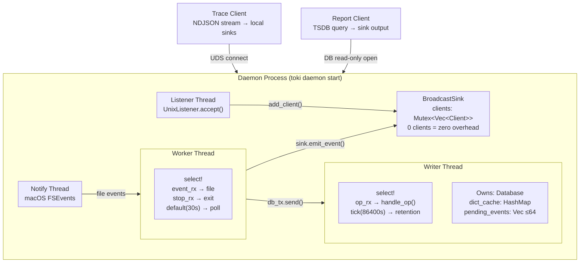

# toki Architecture & Design

## Overview

toki는 데몬/클라이언트 구조로 동작한다.
데몬은 4개 스레드(Worker, Writer, Listener, Notify)를 운용하며,
fjall 임베디드 DB의 7개 keyspace에 데이터를 저장한다.

## Architecture



### Daemon Process

데몬은 4개 스레드로 구성된다:

1. **Worker Thread**: FSEvents 파일 변경 감지 → 파싱 → Sink 출력 + TSDB 저장
2. **Writer Thread**: DB를 단독 소유. 이벤트 배치 커밋, rollup-on-write, retention
3. **Listener Thread**: UDS accept loop. 새 클라이언트를 BroadcastSink에 등록. 멀티 DB 쿼리 병합
4. **Notify Thread**: macOS FSEvents (notify 라이브러리 내부)

### BroadcastSink (Zero Overhead)

`BroadcastSink`는 `Sink` trait을 구현하며, 연결된 trace 클라이언트에 이벤트를 fan-out한다.

- 클라이언트가 0개일 때: `emit_*` 메서드는 `Mutex::lock()` → `is_empty()` → return. 실질적 no-op.
- 클라이언트가 있을 때: 이벤트를 JSON 직렬화 → 각 클라이언트에 NDJSON 줄 전송
- 쓰기 실패한 클라이언트는 자동 제거 (`retain_mut`)
- 1초 write timeout으로 느린 클라이언트가 engine thread를 block하지 않음

### Trace Client

```
UnixStream::connect(daemon.sock)
    → BufReader::lines()
    → JSON parse → match type
        "event" → UsageEvent 역직렬화 → local sink.emit_event()
        "summary" → pass through
```

trace 클라이언트는 모든 sink 타입을 지원한다:
- `--sink print` (기본): 터미널 table/json 출력
- `--sink uds://...`: 다른 UDS로 중계
- `--sink http://...`: HTTP POST로 중계

### Report Client

```
UDS connect (daemon.sock)
    → JSON 쿼리 전송 (PromQL 스타일)
    → daemon이 TSDB에서 실행 후 JSON 응답
    → client가 pricing 적용 + sink 출력
```

Report는 daemon에 UDS로 쿼리를 보내고 결과를 받는다 (fjall DB lock 때문에 직접 DB open 불가).
데몬이 실행 중이어야 report를 사용할 수 있다 (PID 파일로 확인).
pricing은 client가 파일 캐시(`~/.config/toki/pricing.json`)에서 로드하여 적용한다.

## Worker Thread

- `crossbeam_channel::select!`로 FSEvents 이벤트, stop 시그널, 30초 백업 폴링을 다중화
- 파일 변경 감지 → `process_file_with_ts()` → 파싱된 이벤트를 Sink에 출력 + `DbOp::WriteEvent`를 writer에 전송
- watch mode에서는 `send()` 사용 (blocking — 데이터 무손실 보장)
- 5초 간격으로 dirty checkpoints를 writer에 batch flush

## Writer Thread

- `Database`를 단독 소유 — Send 이슈 없음, 단일 스레드 접근
- `DbOp` 수신 → pending에 축적 → 64개 도달 시 batch commit
- Dictionary cache를 메모리에 유지 (일반 HashMap, DashMap 불필요)
- 일 1회 retention tick으로 오래된 데이터 자동 삭제
- Shutdown 시 잔여 pending events flush 후 종료

## Startup Sequence

```
1. 설정된 provider 목록 로드
2. Provider별 Database::open() + load_all_checkpoints()
3. Provider별 (db_tx, db_rx) = bounded(1024)
4. Provider별 Writer thread spawn (Database 소유권 이전)
5. Provider별 TrackerEngine::new(db_tx, checkpoints, BroadcastSink)
6. Cold start: 전체 세션 파일 스캔 → TSDB에 이벤트 저장 + 요약 출력
7. Watcher + Worker thread spawn
8. Write PID file
9. Listener thread spawn (UDS accept loop + 멀티 DB 쿼리 병합)
10. Wait for SIGTERM/SIGINT
```

데몬은 `toki daemon start`로 시작하며 기본적으로 백그라운드로 분리된다. 디버그 시에는 `--foreground` 옵션을 사용한다. 소켓 경로, Claude Code root 등 설정은 `toki settings` TUI에서 관리하며 `toki daemon restart`로 반영한다.
Provider는 `toki settings set providers --add/--remove`로 관리한다.
DB를 처음부터 다시 구축하려면 `toki daemon reset` 후 `toki daemon start`를 사용한다.

## Shutdown Sequence

```
1. SIGTERM/SIGINT 수신
2. Listener stop → listener thread join
3. stop_tx.send() → Worker thread 종료 (잔여 checkpoints flush)
4. db_tx.send(Shutdown) → Writer thread 종료 (잔여 events flush)
5. Worker thread join → Writer thread join
6. PID file 삭제 + socket 파일 삭제
```

## TSDB Schema

fjall의 7개 keyspace:

| Keyspace | Key | Value | 용도 |
|----------|-----|-------|------|
| `checkpoints` | file_path (string) | bincode(FileCheckpoint) | 증분 읽기 위치 |
| `meta` | key (string) | value (string) | 설정, 가격 캐시 |
| `events` | `[ts_ms BE:8][message_id]` | bincode(StoredEvent) | 개별 이벤트 |
| `rollups` | `[hour_ts BE:8][model_name]` | bincode(RollupValue) | 시간별 모델 집계 |
| `idx_sessions` | `{session_id}\0[ts:8][msg_id]` | empty | 세션 인덱스 |
| `idx_projects` | `{project}\0[ts:8][msg_id]` | empty | 프로젝트 인덱스 |
| `dict` | string | bincode(u32) | 문자열 → ID 딕셔너리 압축 |

- Big-endian timestamp → lexicographic = chronological 정렬
- Range scan으로 시간 범위 쿼리 가능
- Index keyspace는 value가 empty — 키 존재 여부만으로 lookup

### Dictionary Compression

반복되는 문자열(model, session_id, source_file)을 u32 ID로 압축하여 `events` keyspace의 value 크기를 줄인다.

- `dict` keyspace: `"claude-opus-4-6"` → `1`, `"session-abc"` → `2`
- Writer thread가 dict_cache를 메모리에 유지, 새 문자열은 자동 등록
- 역방향 조회(ID → string)는 `load_dict_reverse()`로 report 시에만 사용

### Rollup-on-Write

이벤트 저장 시 시간별 rollup도 동시에 갱신한다 (read-modify-write):

```
hour_ts = ts_ms - (ts_ms % 3_600_000)  // 시간 단위 절삭
key = (hour_ts, model_name)
rollup = db.get_rollup(key) or default
rollup += event tokens
batch.upsert_rollup(key, rollup)
```

Report에서 일별/월별 등 시간 그룹핑은 rollup keyspace만 스캔하면 되므로
전체 이벤트를 읽을 필요가 없다.

### Batch Transaction

Writer thread는 64개 이벤트를 모아서 단일 `OwnedWriteBatch`로 commit한다:

```
1. Drain pending_events
2. Rollup read-modify-write (hour별 기존값 읽기 → 누적)
3. Dict ID 해석 (cache hit → 0 alloc, miss → dict keyspace 추가)
4. events, idx_sessions, idx_projects, rollups 일괄 insert
5. batch.commit()
```

## Data Flow

### Cold Start (daemon start)

```
discover_sessions()
    → SessionGroup[] (parent.jsonl + subagent/*.jsonl)
    → rayon parallel_scan (CPU 코어 수 제한)
        → process_lines_streaming() per file
        → parse_line_with_ts() → UsageEventWithTs
        → db_tx.send(WriteEvent)     ← blocking send (데이터 무손실)
        → accumulate to local HashMap
    → merge summaries
    → sink.emit_summary()
    → db_tx.send(FlushCheckpoints)
```

Cold start에서는 blocking `send`를 사용한다.
rayon 스레드가 bounded channel(1024)을 채우면 writer가 소화할 때까지 대기하여
데이터 무손실을 보장한다.

### Watch Mode (실시간)

```
FSEvents → event_tx → Worker thread
    → stat() 크기 비교 (1-5µs fast skip)
    → find_resume_offset() 역순 스캔
    → process_lines_streaming() 증분 읽기
    → parse_line_with_ts()
    → BroadcastSink.emit_event()    ← 0 clients이면 no-op
    → db_tx.send(WriteEvent)        ← blocking (데이터 무손실 보장)
```

### Trace Client (실시간 스트림)

```
UnixStream::connect(daemon.sock)
    → BufReader::lines() loop
    → JSON parse → type 분기
        "event" → UsageEvent 역직렬화 → local sink.emit_event()
```

### Report (one-shot 조회)

```
daemon_status(pidfile)?
    → None: "Cannot connect to toki daemon" → exit
    → Some: continue

DB open → has_any_rollups()? (O(1) 확인)
    → No:  "No data in TSDB" (cold start 진행 중일 수 있음)
    → Yes: 쿼리 실행
```

Report는 writer thread 없이 DB를 직접 읽기 전용으로 연다.
스트리밍 콜백 패턴으로 중간 Vec 할당 없이 집계한다.

## File Processing Pipeline

### Active/Idle 분류

macOS FSEvents는 디렉토리 내 파일 하나가 변해도 같은 디렉토리의 모든 파일에
이벤트를 발생시킨다. 파일별 상태를 추적하여 불필요한 처리를 최소화한다.

| 상수 | 값 | 역할 |
|------|----|------|
| `ACTIVE_COOLDOWN` | 150ms | Active 파일 재처리 최소 간격 |
| `IDLE_COOLDOWN` | 500ms | Idle 파일 stat() 최소 간격 |
| `IDLE_TRANSITION` | 15s | 새 줄 없이 경과 시 Idle 전환 |

```
process_file_with_ts(path)
    → FileActivity 존재?
        No  → Active (새 파일)
        Yes → 15s 경과? → Idle 전환
    → 쿨다운 체크 (Active: 150ms, Idle: 500ms)
    → stat() 크기 비교 (크기 변화 없으면 즉시 skip)
    → find_resume_offset() + process_lines_streaming()
    → 새 줄 있으면 파싱 + checkpoint 갱신 + Active 승격
```

### Fast Skip (크기 기반)

- watch 이벤트 수신 시 `stat()`으로 파일 크기만 확인 (파일 open/read 없음)
- 크기 변화 없으면 즉시 스킵 (~1-5µs vs 기존 ~150-300µs)
- JSONL 특성상 새 줄 추가 = 크기 증가이므로 false negative 없음

### 역순 스캔 (Checkpoint Recovery)

- 파일 끝에서 4KB 청크 단위로 역순 읽기
- 라인 길이 pre-filter (O(1) 정수 비교, ~85% 후보 제거)
- 길이 일치 시에만 xxHash3-64 비교 (30GB/s)
- Compaction으로 바이트 위치가 변해도 라인 해시로 복구

## Retention Policy

Writer thread가 데이터 보존 정책을 자동 실행한다 (기본 비활성화, `toki settings`에서 설정):

| 대상 | 기본 보존 기간 | DB key |
|------|----------------|--------|
| events | 0 (무제한) | `retention_days` |
| rollups | 0 (무제한) | `rollup_retention_days` |

- 0 = 비활성화 (삭제하지 않음)
- 시작 시 1회 + 이후 24시간 간격으로 실행
- 1000개 키 단위로 batch 삭제 (대량 삭제 시 write stall 방지)
- 인덱스(idx_sessions, idx_projects)는 삭제 생략
  - 키가 `{prefix}\0{ts}{msg_id}` 구조라 시간 순 정렬이 아님 → O(n) full scan 필요
  - 고아 인덱스 엔트리는 value가 empty이므로 크기 무시 가능

## Data Types

### StoredEvent (events keyspace value)

```rust
pub struct StoredEvent {
    pub model_id: u32,                    // dict compressed
    pub session_id: u32,                  // dict compressed
    pub source_file_id: u32,             // dict compressed
    pub input_tokens: u64,
    pub output_tokens: u64,
    pub cache_creation_input_tokens: u64,
    pub cache_read_input_tokens: u64,
}
```

### RollupValue (rollups keyspace value)

```rust
pub struct RollupValue {
    pub input: u64,
    pub output: u64,
    pub cache_create: u64,
    pub cache_read: u64,
    pub count: u64,
}
```

### FileCheckpoint (checkpoints keyspace value)

```rust
pub struct FileCheckpoint {
    pub file_path: String,
    pub last_line_len: u64,      // 라인 길이 pre-filter용
    pub last_line_hash: u64,     // xxHash3-64
}
```

### DbOp (Writer thread channel message)

```rust
pub enum DbOp {
    WriteEvent { ts_ms, message_id, model, session_id, source_file, tokens },
    WriteCheckpoint(FileCheckpoint),
    FlushCheckpoints(Vec<FileCheckpoint>),
    Shutdown,
}
```

## Query Architecture

Report 명령은 DB를 읽기 전용으로 열어 직접 쿼리한다 (writer thread 불필요).

### 쿼리 경로

CLI 플래그(`--session-id`, `--project`, `--since`, `--until`, `--group-by-session`)는 내부적으로 `Query` 구조체로 변환되어 `execute_parsed_query`를 통해 실행된다.
시간 그룹핑 서브커맨드(daily/weekly/monthly/yearly/hourly)는 캘린더 기반 버킷팅이 필요하므로 `report_grouped_from_db`를 통해 실행된다.

| 함수 | 데이터 소스 | 용도 |
|------|-------------|------|
| `execute_parsed_query` | events + dict 또는 rollups | PromQL 쿼리 + CLI 플래그 변환 실행 |
| `report_grouped_from_db` | rollups 또는 events + dict | 시간별 그룹핑 (daily/weekly/...) |
| `has_tsdb_data` | rollups (O(1)) | TSDB 데이터 존재 여부 확인 |

### 데이터 소스 선택

쿼리의 필터와 그룹핑 조건에 따라 데이터 소스가 결정된다:

| 조건 | 데이터 소스 | 이유 |
|------|-------------|------|
| 필터/그룹 없이 전체 요약 | rollups | 빠름 (시간별 사전 집계) |
| `session` 또는 `project` 필터 있음 | events + dict | rollup에 세션/프로젝트 정보 없음 |
| `by (session)` 등 그룹핑 | events + dict | rollup에 세션/프로젝트 정보 없음 |
| 시간 그룹핑만 (daily/weekly/...) | rollups | 빠름 |
| 시간 그룹핑 + 세션/프로젝트 필터 | events + dict | 이벤트 레벨 필터링 필요 |
| `sessions` / `projects` 리스팅 | idx_sessions/idx_projects 또는 events | 시간 필터 없으면 인덱스, 있으면 이벤트 스캔 |

### 스트리밍 콜백 패턴

```rust
db.for_each_rollup(since, until, |ts, model, rollup| { ... })
db.for_each_event(since, until, |ts, event| { ... })
```

- 중간 Vec 할당 없이 HashMap에 직접 accumulate
- `has_tsdb_data`는 `first_key_value().is_some()`으로 O(1)

## Config Priority

설정 값은 다음 우선순위로 결정된다:

```
CLI 인자 > 설정 파일 (~/.config/toki/settings.json) > 기본값
```

설정 파일은 `toki settings` (TUI) 또는 `toki settings set/get/list` (CLI)로 관리한다.
Provider는 `toki settings set providers --add/--remove`로 관리한다.
환경변수는 사용하지 않는다 (`TOKI_DEBUG` 제외).

| 설정 | CLI 오버라이드 | settings key | 기본값 |
|------|---------------|-------------|--------|
| Providers | - | `providers` | `[]` |
| Claude root | - | `claude_code_root` | `~/.claude` |
| DB path | - | - | `~/.config/toki/<provider>.fjall` |
| Daemon sock | - | `daemon_sock` | `~/.config/toki/daemon.sock` |
| Timezone | `-z` | `timezone` | (UTC) |
| Output format | `--output-format` | `output_format` | `table` |
| Start of week | `--start-of-week` | `start_of_week` | `mon` |
| No cost | `--no-cost` | `no_cost` | `false` |
| Retention | - | `retention_days` | `0` (disabled) |
| Rollup retention | - | `rollup_retention_days` | `0` (disabled) |

## Backpressure

Engine → Writer 간 bounded channel(1024):

| 상황 | 동작 |
|------|------|
| Cold start (rayon parallel scan) | `send()` — blocking. 데이터 무손실 보장 |
| Watch mode (실시간 이벤트) | `send()` — blocking. 데이터 무손실 보장 |
| Checkpoints flush | `send()` — blocking. 체크포인트 손실 방지 |

Cold start와 watch mode 모두 blocking `send()`를 사용하여 채널이 꽉 차면 writer가 소화할 때까지 대기한다. 데이터 무손실을 보장한다.
