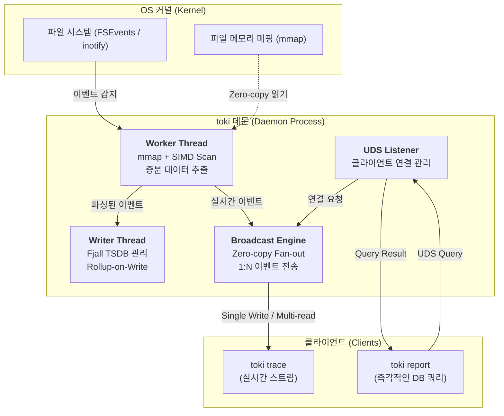
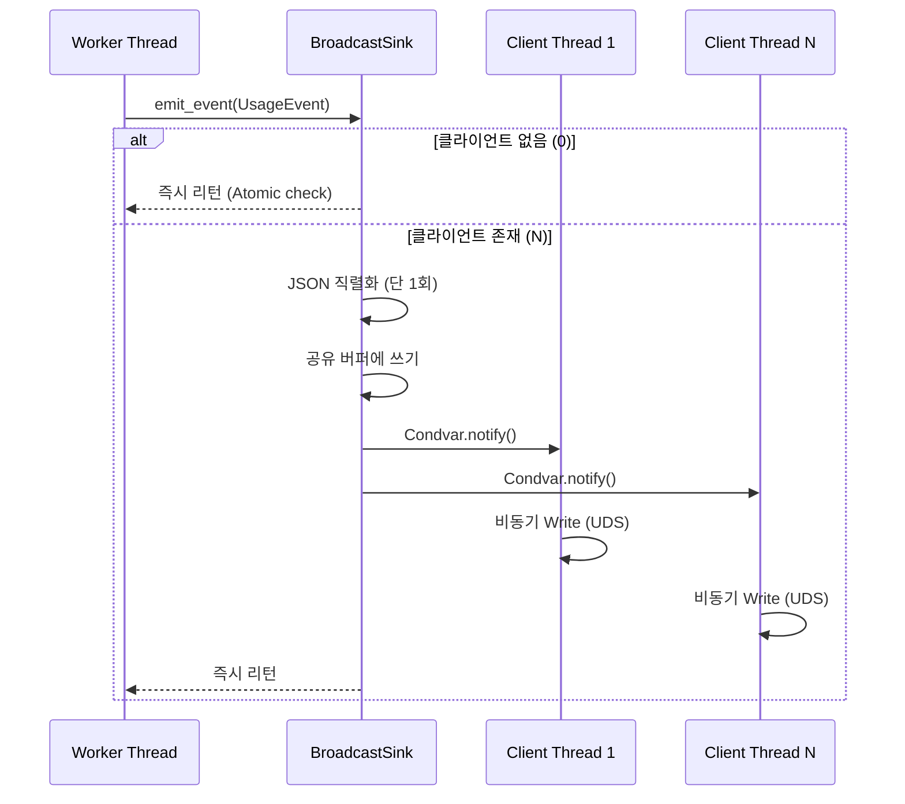

# toki 설계 및 아키텍처 (toki Architecture & Design)

이 문서에서는 `toki`가 대용량 토큰 로그를 **Zero-Overhead**로 처리하고, 사용자 작업을 전혀 방해하지 않는 **Non-blocking** 구조를 어떻게 구현했는지 설명합니다.

---

## 🏗 전체 아키텍처 (High-Level Architecture)

`toki`는 자원 분리와 데이터 무결성을 위해 **멀티 스레드 데몬(Daemon)** 구조를 사용합니다.

---

## ⚡️ I/O 혁신: 왜 toki는 작업을 방해하지 않는가?

기존 도구들은 `read()` 시스템 콜로 데이터를 커널에서 유저 공간으로 복사한 뒤 전체를 루프 돌리는 방식입니다. `toki`는 여기서 다른 접근을 택했습니다.

### 1. mmap 기반 Zero-copy 읽기
- 파일을 프로세스 메모리에 직접 매핑(`mmap`)해서 불필요한 복사 비용을 없앴습니다.
- OS의 페이지 캐시를 그대로 활용하기 때문에, 이미 읽은 데이터를 다시 읽어도 CPU 부하가 거의 없습니다.

### 2. SIMD (memchr) 가속 스캔
- 줄바꿈(`\n`)을 찾을 때 단순 루프 대신 CPU의 **SIMD(Single Instruction, Multiple Data)** 명령어를 씁니다.
- 기가바이트 텍스트에서도 수십 GB/s 속도로 줄바꿈을 찾아내서, 로그 처리에 드는 CPU 시간을 최소화합니다.

### 3. xxHash3 기반 스마트 체크포인트
- `xxHash3-64` 알고리즘으로 마지막 읽기 지점의 무결성을 검증합니다.
- 파일 크기뿐 아니라 내용의 해시까지 대조하기 때문에, 로그 로테이션이나 수동 편집이 있어도 정확히 중단된 지점부터 **증분 읽기(Incremental Read)**를 수행합니다.

---

## 📡 1:N 브로드캐스팅: Zero-Overhead 설계

`toki trace` 클라이언트가 아무리 많이 붙어도 데몬 성능이 떨어지지 않는 비결은 **Broadcast Engine**에 있습니다.

### Zero-Overhead logic
1.  **Atomic Check (0 클라이언트):** 연결된 클라이언트가 없으면, 원자적 정수 하나만 확인하고 모든 로직을 건너뜁니다. 사실상 **No-op**입니다.
2.  **Single Serialization:** 클라이언트가 1명이든 100명이든, JSON 직렬화는 딱 **한 번**만 합니다.
3.  **Condvar Fan-out:** 공유 버퍼에 데이터를 쓰고 `Condvar::notify_all()`로 대기 중인 모든 클라이언트 스레드를 동시에 깨웁니다.
4.  **Lock-free Read:** 각 클라이언트 스레드는 독립된 큐를 가지고 있어서, 메인 워커 스레드를 블로킹하지 않고 비동기로 데이터를 보냅니다.

---

## 🗄 데이터 레이어: 시계열 DB 최적화

`toki`는 임베디드 시계열 DB인 `fjall`을 기반으로 데이터를 관리합니다.

### 1. Rollup-on-Write
- 데이터가 들어오는 시점에 시간별(Hourly) 합계를 미리 계산해서 저장합니다.
- 한 달 치 사용량을 조회할 때 수백만 개 이벤트를 전부 읽을 필요 없이, 미리 계산된 수백 개의 **Rollup** 데이터만 읽으면 됩니다. 리포트 속도 **7ms**의 비결입니다.

### 2. Dictionary Compression
- 반복되는 모델 이름(`claude-3-7-sonnet...`), 세션 ID 등의 문자열을 정수형 ID로 압축합니다.
- 디스크 사용량을 80% 이상 줄이고, I/O 부하도 최소화합니다.

---

## 🧵 멀티 스레딩 모델 (Thread Safety)

`toki`는 각 역할별로 스레드를 분리해서 락 경합(Lock Contention)을 최소화했습니다.

- **Worker Thread:** 파일 시스템 이벤트를 받아서 로그를 파싱합니다.
- **Writer Thread:** DB 소유권을 독점하고 순차적으로 쓰기를 수행합니다 (Write Stall 방지).
- **Listener Thread:** UDS 연결과 쿼리 요청을 처리합니다.
- **Notify Thread:** OS(macOS FSEvents 등)의 저수준 이벤트를 수신하는 백그라운드 스레드입니다.

덕분에 **Cold Start** 때는 하드웨어의 모든 성능을 끌어쓰고, **Watch Mode**에서는 시스템에 없는 것처럼 조용히 돌아갑니다.
