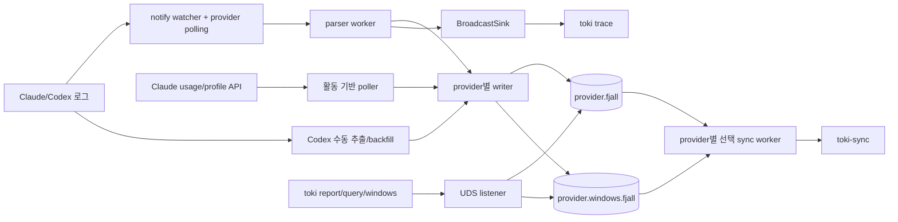

# toki 아키텍처와 설계

이 문서는 현재 개발 브랜치 구현을 설명한다. `docs/archive/`의 과거 계획은
runtime contract가 아니다.

## 프로세스 모델

toki는 macOS와 Linux에서 daemon/client 구조로 동작한다. CLI는 Unix domain
socket으로 daemon과 통신하며 실행 중인 fjall 이벤트 DB를 직접 열지 않는다.


```mermaid
flowchart LR
    Logs[Claude/Codex 로그] --> Watchers[notify watcher + provider polling]
    Watchers --> Worker[parser worker]
    Worker --> Writers[provider별 writer]
    Writers --> EventDB[(provider.fjall)]
    Worker --> Broadcast[BroadcastSink]
    Broadcast --> Trace[toki trace]

    ClaudeAPI[Claude usage/profile API] --> ClaudePoll[활동 기반 poller]
    ClaudePoll --> Writers
    Logs --> CodexWindows[Codex 수동 추출/backfill]
    CodexWindows --> Writers
    Writers --> WindowDB[(provider.windows.fjall)]

    CLI[toki report/query/windows] --> Listener[UDS listener]
    Listener --> EventDB
    Listener --> WindowDB

    EventDB --> Sync[provider별 선택 sync worker]
    WindowDB --> Sync
    Sync --> Server[toki-sync]
```

스레드 수는 고정된 “4개” contract가 아니라 설정에 따라 달라진다:

- 활성 provider별 event writer 한 개
- 파일 처리 worker와 notify가 소유한 watcher thread
- UDS listener와 연결 handler
- 연결된 trace client별 helper thread 두 개
- 선택적인 provider별 sync worker
- 선택적인 Claude window poller와 Codex window backfill worker

async runtime은 쓰지 않는다. `std::thread`, mutex/condvar, bounded
`crossbeam-channel`로 조정한다.

## Provider와 platform 경계

Provider별 discovery/parser는 `src/providers/` trait을 구현한다. Claude Code와
Codex CLI가 production provider다. 둘 다 append 중심 JSONL이지만 discovery
규칙과 토큰 column 의미는 별도로 유지한다.

Platform service는 `src/platform/mod.rs` 뒤에 있다:

- macOS: FSEvents, launchd 자동 시작
- Linux: inotify, 사용자 systemd 자동 시작
- Windows는 CLI/daemon IPC가 Unix socket API를 무조건 사용하므로 현재 지원
  build가 아니다.

macOS Codex는 session fd를 계속 열어 FSEvents를 늦출 수 있어 1초 stat 기반
poll도 사용한다. Polling이 필요 없는 provider에는 never-ready channel을 써서
worker poll tick 오버헤드를 없앤다.

## 수집과 checkpoint

### Cold start

설정된 provider별로 session file을 찾고 rayon으로 병렬 스캔한다. 파싱한
event는 bounded channel로 provider writer에 보낸다. 설치 이전 이력을 가져오기
위해 최초 전체 스캔은 필요하다.

### 증분 watch

Worker는 filesystem notification을 받고 file size를 확인한 뒤 마지막 처리
line의 길이와 xxHash3-64 fingerprint를 역순 탐색한다. 그 이후의 완전한 line만
파싱한다. Checkpoint는 byte offset이 아닌 file path와 마지막 line 길이/hash를
저장하므로 append나 compaction 뒤에도 stale position을 신뢰하지 않고 복구한다.

Cold-start와 watch write는 blocking send를 사용한다. Backpressure 시 parser를
늦추고 usage data를 버리지 않는다.

### 중복 제거

Event key는 big-endian millisecond timestamp로 시작한다. `idx_msg`는 bare message
ID를 최신 event key에 매핑해 streaming snapshot이 이전 값을 대체하게 한다.
Codex identity에는 per-event 요소가 있어 한 message의 여러 usage event가 하나로
합쳐지지 않는다.

## 저장소

Provider마다 복구 속성이 다른 fjall DB 두 개를 가진다.

### 재구축 가능한 event DB

경로: `~/.config/toki/<provider>.fjall`

| Keyspace | 역할 |
|----------|------|
| `checkpoints` | file path → `FileCheckpoint` |
| `meta` | schema version과 내부 marker |
| `events` | `[timestamp_ms BE][event identity]` → `StoredEvent` |
| `idx_sessions` | session prefix lookup key |
| `idx_projects` | project prefix lookup key |
| `dict` | string → 압축 numeric ID |
| `idx_msg` | bare message ID → 최신 event key |

rollup keyspace와 rollup-on-write 경로는 없다. Summary와 calendar group은
시간순 event keyspace를 스캔해 map에 집계한다. 시간/project 조건이 없는
session/project 목록은 인덱스를 사용한다.

`SCHEMA_VERSION`이 serialized event layout을 보호한다. 불일치 시 이 재구축형
DB만 삭제하고 sync 진행 상태를 지워 provider log를 다시 import한다.

### 비재구축형 window DB

경로: `~/.config/toki/<provider>.windows.fjall`

`windows` keyspace와 독립 `WINDOWS_SCHEMA_VERSION`을 둔 `meta` keyspace가 있다.
Window identity는 다음과 같다:

```text
[kind][limit_id_hash][account_hash][window_anchor_ms]
```

Window snapshot은 versioned 형식이며 field별 merge한다. 더 새 버전의 모르는
schema는 read-only로 연다. Downgrade daemon이 재구축할 수 없는 관측치를 지우거나
수정하면 안 된다. 따라서 `toki daemon reset`은 event DB만 지우고 window DB와
설정을 보존한다.

## Rate-limit windows

`window_tracking` 기본값은 true다.

- Codex 관측치는 rollout log에서 inline 파싱한다. Background backfill은 첫
  사용에 60일, 이후 시작 시 최근 8일을 다시 확인한다.
- Claude 관측치는 로컬 인증 정보와 usage/profile endpoint가 필요하다. Poll은
  Claude token write 활동으로 gate되며 `window_polling=false`로 hot-disable한다.
- Tracker는 open identity 수를 제한하고 정수 percent/heartbeat 변화만 저장하며,
  out-of-order 관측을 merge하고 reset 뒤 finalized 상태를 파생한다.
- Log timestamp는 finalize 전에 wall clock으로 clamp해 미래로 치우친 한 줄이
  현재 window를 조기 종료하지 못하게 한다.

UDS `WINDOWS` 요청은 `toki windows status`를, `windows` metric의 `REPORT`는
history와 `toki query windows`, remote sync output을 제공한다.

## Query 경로

Listener는 세 protocol family를 받는다:

- `TRACE`: `BroadcastSink`로 event JSONL stream
- `REPORT`: usage, cost, events, windows, sessions, projects 실행
- `WINDOWS`: provider별 live window 상태 반환 및 선택적 bounded Claude refresh

시간 bound는 `parse_range_time`이 해석한다. 로컬 형식은 compact/dashed date,
compact datetime, Unix seconds/milliseconds, RFC 3339/ISO 8601이다. Date-only end는
그날 마지막 millisecond가 된다. 역전 범위는 실행 전과 UDS 경계에서 거부한다.

`toki query`가 유일한 자유 query 명령이다. `--start`, `--end`, `--step`을
지원하며 `toki report query`는 없다. 로컬 grouping은 selector(`[1h]`, `[1d]`,
`[1w]`)를 쓴다. 원격에서는 명시적 step이 우선이고 아니면 selector로 유도한다.

원격 response는 동일 sink type으로 normalize하지만 현재 server 제한은 남는다.
Cursor pagination이 없고 큰 결과는 잘릴 수 있으며 server time parser는 모든
로컬 RFC 3339 형식과 아직 같지 않다.

## 가격

Daemon은 live trace event용 LiteLLM 가격을 가져온다. Report/query client도
`--no-cost`가 아니면 동일 file cache를 사용한다. 원격 query는 로컬 가격이
없을 때 server 계산 cost를 fallback으로 쓴다.

정확한 모델 매치가 우선이다. 알려진 Claude `-fast` variant는 base 가격에
provider 2배 table을 적용할 수 있다. LiteLLM에 cache-read rate가 없으면 cached
input을 무료로 보지 않고 일반 input rate를 쓴다. Cache-creation 가격 누락은
provider 독립적인 보수 대체값이 정의되지 않아 0으로 남는다.

## Sync

Sync는 opt-in이다. Provider별 sync worker는 event와 window upload를 한
persistent TCP/TLS 연결에서 공유한다. Event는 batch되고 큰 batch는 zstd 압축되며,
ACK 진행 상태를 로컬에 저장해 reconnect/delta sync한다. 설정 watcher 덕분에
sync enable/disable과 Claude window polling toggle은 daemon 재시작 없이
반영된다. Event/window retention policy는 시작 때 capture되므로 재시작이 필요하다.

인증 정보는 macOS Keychain 또는 Linux permission-restricted JSON에 저장한다.
Stable device identity는 `~/.config/toki/device_id`에 있다.

Protocol dependency는 daemon과 sync server가 사용하는 `SyncWindows`/
`WireWindow` contract를 포함한 `toki-sync-protocol` v1.1.0에 고정돼 있다.

## Retention과 복구

- `retention_days=0`은 event를 무제한 보존한다. 양수면 오래된 event와 index를
  삭제하고 미사용 dictionary entry를 GC한다.
- `window_retention_days=730`은 독립적이며 event retention이 꺼져도 실행된다.
- Retention은 시작 시와 writer의 일일 tick에 실행된다.
- stale open window finalize는 삭제 설정과 독립적이다.

## 설정과 network 동작

우선순위는 CLI override → `~/.config/toki/settings.json` → 기본값이다.
`TOKI_HOME`은 격리 실행의 home root를, `TOKI_DEBUG`는 진단 로그를 제어한다.

파싱과 로컬 query는 로컬이지만 daemon은 다음 outbound 요청을 할 수 있다:

- LiteLLM 가격 fetch(report/query `--no-cost`는 client 작업을 생략하지만
  daemon은 현재 시작 시 fetch하며 trace는 출력만 제거)
- GitHub release update 요청(daemon이 로컬 cache 갱신)
- 활성화된 활동 기반 Claude usage/profile polling
- sync 활성화 시 설정한 toki-sync traffic

Prompt, response, file content, thinking block은 event DB에 저장하거나 sync하지
않는다. 저장/sync field는 token count와 model/provider/session/project/timestamp/
device 같은 routing metadata다.

## Backpressure와 shutdown

Event/writer channel은 1024 operation으로 bounded다. Event와 checkpoint send는
가득 차면 block한다. Writer는 64 event 또는 timed flush에 commit한다.

Shutdown은 listener intake, sync/backfill/poller, file worker, provider writer
순으로 멈춘다. 남은 event, checkpoint, open window 상태를 flush한 뒤 join한다.
Library 사용자의 `Handle`도 drop 시 shutdown한다.
