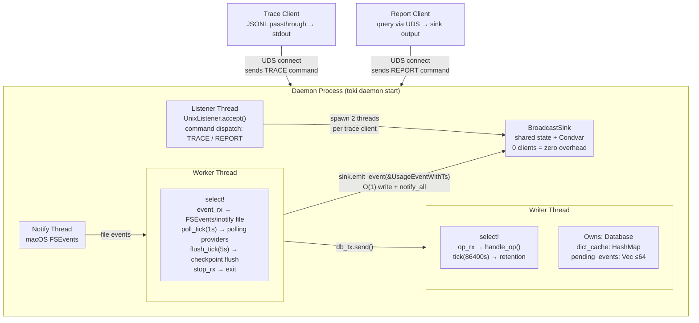

# toki Architecture & Design

## Overview

toki operates with a daemon/client architecture.
The daemon runs 4 threads (Worker, Writer, Listener, Notify) and stores data in 7 keyspaces of an embedded fjall DB.

## Architecture



### Daemon Process

The daemon has a base of 4 threads, plus 2 threads per connected trace client (4 + 2N total):

1. **Worker Thread**: Detects file changes via FSEvents (all providers) + 1-second polling (providers that keep fds open, e.g. Codex on macOS) → parses → Sink output + TSDB storage
2. **Writer Thread**: Sole owner of the DB. Batch event commits, rollup-on-write, retention
3. **Listener Thread**: UDS accept loop. Reads client command (`TRACE\n` or `REPORT\n`) via BufReader, dispatches accordingly
4. **Notify Thread**: macOS FSEvents (internal to the notify library)
5. **Per trace client: +2 threads** (receiver thread + writer thread, see BroadcastSink below)

### BroadcastSink (Zero Overhead, Condvar-based)

`BroadcastSink` implements the `Sink` trait and fans out events to connected trace clients. No tokio dependency — pure `std::sync`.

- **Engine write path (O(1))**: `emit_event()` writes to shared state → `condvar.notify_all()`. The engine thread is never blocked by slow clients.
- **When 0 clients**: effectively a no-op (shared state write + notify on empty wait set).
- **Per client: 2 threads**:
  - **Thread A (receiver)**: waits on condvar, clones message, pushes to a local queue
  - **Thread B (writer)**: drains queue in batch, writes to UDS
- **Dead client detection**:
  - Thread A uses `wait_timeout(5s)` to detect stale connections
  - Thread B detects `EPIPE` on write and triggers cleanup
- **Thread spawn failure**: error is logged and the client is notified via the stream before cleanup

### Trace Client

```
UnixStream::connect(daemon.sock)
    → send "TRACE\n" command
    → BufReader::lines()
    → JSONL passthrough to stdout
```

Trace always outputs JSONL to stdout regardless of `--output-format`. The `--output-format` and `--sink` flags only apply to report, not trace. No `UsageEvent` deserialization on the client side — raw JSON passthrough.

Each JSONL line includes: `model`, `source`, `provider`, `timestamp` (original from session file), token fields, `cost_usd`.

### Report Client

```
UnixStream::connect(daemon.sock)
    → send "REPORT\n" command
    → send JSON query payload
    → daemon executes against TSDB, returns JSON response
    → client applies pricing + sink output
```

Report sends a query to the daemon over UDS (sends `REPORT\n` then JSON payload) and receives results. The client does NOT open the DB directly (not possible due to fjall DB lock).
The daemon must be running to use report (verified via PID file).
Pricing is loaded by the client from the file cache (`~/.config/toki/pricing.json`).

## Worker Thread

- Multiplexes FSEvents events, per-provider poll tick, flush tick, and stop signal via `crossbeam_channel::select!`
- **FSEvents path**: file change detected → `process_and_print_provider()` → parsed events output to Sink + `DbOp::WriteEvent` sent to writer
- **Poll tick path (1s, macOS Codex only)**: globs `poll_dirs()` → stat-based size comparison via existing `file_sizes` cache → processes only files that have grown. `crossbeam_channel::never()` when no provider needs polling (zero overhead on Linux/Windows or Claude-only setups)
- Watch mode uses blocking `send` (consistent with cold start, zero data loss)
- Every 5 seconds, dirty checkpoints are batch-flushed to the writer

## Writer Thread

- Sole owner of `Database` — no Send issues, single-thread access
- Receives `DbOp` → accumulates in pending → batch commit when 64 events reached or every 1 second
- Maintains dictionary cache in memory (plain HashMap, no DashMap needed)
- Daily retention tick automatically deletes old data
- On shutdown, flushes remaining pending events before exit

## Startup Sequence

```
1. Database::open() + load_all_checkpoints()
2. (db_tx, db_rx) = bounded(1024)
3. Writer thread spawn (Database ownership transferred)
4. TrackerEngine::new(db_tx, checkpoints, BroadcastSink)
5. Cold start: scan all session files → store events in TSDB + output summary
6. Watcher + Worker thread spawn
7. Write PID file
8. Listener thread spawn (UDS accept loop, command-based dispatch: TRACE/REPORT)
9. Wait for SIGTERM/SIGINT
```

The daemon starts with `toki daemon start`, which detaches to the background by default. Use `--foreground` for debug logging. Settings like socket path, Claude Code root, etc. are managed via `toki settings` TUI and applied with `toki daemon restart`.
Providers are managed with `toki settings set providers --add/--remove`.
To rebuild the DB from scratch, use `toki daemon reset` followed by `toki daemon start`.

## Shutdown Sequence

```
1. Receive SIGTERM/SIGINT
2. Listener stop → listener thread join
3. stop_tx.send() → Worker thread exit (flush remaining checkpoints)
4. db_tx.send(Shutdown) → Writer thread exit (flush remaining events)
5. Worker thread join → Writer thread join
6. Delete PID file + socket file
```

## TSDB Schema

7 keyspaces in fjall:

| Keyspace | Key | Value | Purpose |
|----------|-----|-------|---------|
| `checkpoints` | file_path (string) | bincode(FileCheckpoint) | Incremental read position |
| `meta` | key (string) | value (string) | Settings, pricing cache |
| `events` | `[ts_ms BE:8][message_id]` | bincode(StoredEvent) | Individual events |
| `rollups` | `[hour_ts BE:8][model_name]` | bincode(RollupValue) | Hourly per-model aggregation |
| `idx_sessions` | `{session_id}\0[ts:8][msg_id]` | empty | Session index |
| `idx_projects` | `{project}\0[ts:8][msg_id]` | empty | Project index |
| `dict` | string | bincode(u32) | String → ID dictionary compression |

- Big-endian timestamp → lexicographic = chronological ordering
- Range scan enables time-range queries
- Index keyspaces have empty values — lookup by key existence only

### Dictionary Compression

Repeated strings (model, session_id, source_file) are compressed to u32 IDs, reducing `events` keyspace value size.

- `dict` keyspace: `"claude-opus-4-6"` → `1`, `"session-abc"` → `2`
- Writer thread maintains dict_cache in memory, new strings are auto-registered
- Reverse lookup (ID → string) via `load_dict_reverse()`, used only during report

### Rollup-on-Write

When storing events, hourly rollups are simultaneously updated (read-modify-write):

```
hour_ts = ts_ms - (ts_ms % 3_600_000)  // truncate to hour
key = (hour_ts, model_name)
rollup = db.get_rollup(key) or default
rollup += event tokens
batch.upsert_rollup(key, rollup)
```

For daily/monthly time grouping in reports, only the rollup keyspace needs scanning — no need to read all events.

### Batch Transaction

The writer thread accumulates up to 64 events (or flushes every 1 second) and commits them in a single `OwnedWriteBatch`:

```
1. Drain pending_events
2. Rollup read-modify-write (read existing hourly values → accumulate)
3. Dict ID resolution (cache hit → 0 alloc, miss → add to dict keyspace)
4. Batch insert into events, idx_sessions, idx_projects, rollups
5. batch.commit()
```

## Data Flow

### Cold Start (daemon start)

```
discover_sessions()
    → SessionGroup[] (parent.jsonl + subagent/*.jsonl)
    → rayon parallel_scan (limited to CPU core count)
        → process_lines_streaming() per file
        → parse_line_with_ts() → UsageEventWithTs
        → db_tx.send(WriteEvent)     ← blocking send (zero data loss)
        → accumulate to local HashMap
    → merge summaries
    → sink.emit_summary()
    → db_tx.send(FlushCheckpoints)
```

Cold start uses blocking `send`.
When rayon threads fill the bounded channel (1024), they wait until the writer catches up, guaranteeing zero data loss.

### Watch Mode (real-time)

```
[FSEvents path — all providers]
FSEvents → event_tx → Worker thread
    → stat() size comparison (1-5µs fast skip)
    → find_resume_offset() reverse scan
    → process_lines_streaming() incremental read
    → parse_line_with_ts()
    → BroadcastSink.emit_event()    ← no-op if 0 clients
    → db_tx.send(WriteEvent)        ← blocking (zero data loss)

[Poll tick path — macOS only, providers with poll_dirs()]
poll_tick(1s) → Worker thread
    → glob poll_dirs()/**/*.jsonl
    → stat() size comparison via file_sizes cache (fast skip if unchanged)
    → same processing pipeline as FSEvents path above
    → crossbeam_channel::never() on Linux/Windows (zero overhead)
```

**Why polling for Codex on macOS**: macOS FSEvents fires `FSE_CONTENT_MODIFIED` only in `vn_close()`. Codex holds a single `tokio::fs::File` open for the entire session and only flushes between turns — never closes. Result: zero FSEvents during an active session, one event on exit. Claude Code closes and reopens its session file per turn, so FSEvents works correctly for it. On Linux, inotify `IN_MODIFY` fires per-write regardless of fd state, so polling is not needed on any provider.

### Trace Client (real-time stream)

```
UnixStream::connect(daemon.sock)
    → send "TRACE\n" command
    → BufReader::lines() loop
    → JSONL passthrough to stdout (no deserialization)
```

### Report (one-shot query)

```
daemon_status(pidfile)?
    → None: "Cannot connect to toki daemon" → exit
    → Some: continue

UDS connect → send "REPORT\n" + JSON query
    → daemon executes query against TSDB
    → returns JSON response
    → client applies pricing + sink output
```

Report sends a query to the daemon over UDS. The client does NOT open the DB directly.

## File Processing Pipeline

### Active/Idle Classification

Per-file state tracking minimizes unnecessary processing, particularly during 1-second poll ticks where unchanged files are stat-checked on every cycle.

| Constant | Value | Role |
|----------|-------|------|
| `ACTIVE_COOLDOWN` | 150ms | Minimum reprocessing interval for active files |
| `IDLE_COOLDOWN` | 500ms | Minimum stat() interval for idle files |
| `IDLE_TRANSITION` | 15s | Transition to idle after no new lines |

```
process_file_with_ts(path)
    → FileActivity exists?
        No  → Active (new file)
        Yes → 15s elapsed? → Transition to Idle
    → Cooldown check (Active: 150ms, Idle: 500ms)
    → stat() size comparison (skip immediately if unchanged)
    → find_resume_offset() + process_lines_streaming()
    → If new lines: parse + update checkpoint + promote to Active
```

### Fast Skip (size-based)

- On watch event, check file size via `stat()` only (no file open/read)
- Skip immediately if size unchanged (~1-5µs vs ~150-300µs)
- JSONL appends = size increase, so no false negatives

### Reverse Scan (Checkpoint Recovery)

- Read backwards from file end in 4KB chunks
- Line length pre-filter (O(1) integer comparison, ~85% candidate elimination)
- xxHash3-64 comparison only on length match (30GB/s)
- Byte position changes from compaction are recovered via line hash

## Retention Policy

The writer thread automatically enforces data retention policy (disabled by default, configured via `toki settings`):

| Target | Default Retention | DB Key |
|--------|-------------------|--------|
| events | 0 (unlimited) | `retention_days` |
| rollups | 0 (unlimited) | `rollup_retention_days` |

- 0 = disabled (no deletion)
- Runs once on startup + every 24 hours thereafter
- Batch deletion in 1000-key units (prevents write stall on large deletions)
- Indexes (idx_sessions, idx_projects) are not deleted
  - Key structure `{prefix}\0{ts}{msg_id}` is not time-sorted → would require O(n) full scan
  - Orphaned index entries have empty values, so size impact is negligible

## Data Types

### StoredEvent (events keyspace value)

```rust
pub struct StoredEvent {
    pub model_id: u32,                    // dict compressed
    pub session_id: u32,                  // dict compressed
    pub source_file_id: u32,             // dict compressed
    pub input_tokens: u64,
    pub output_tokens: u64,
    pub cache_creation_input_tokens: u64,
    pub cache_read_input_tokens: u64,
}
```

### RollupValue (rollups keyspace value)

```rust
pub struct RollupValue {
    pub input: u64,
    pub output: u64,
    pub cache_create: u64,
    pub cache_read: u64,
    pub count: u64,
}
```

### FileCheckpoint (checkpoints keyspace value)

```rust
pub struct FileCheckpoint {
    pub file_path: String,
    pub last_line_len: u64,      // for line length pre-filter
    pub last_line_hash: u64,     // xxHash3-64
}
```

### DbOp (Writer thread channel message)

```rust
pub enum DbOp {
    WriteEvent { ts_ms, message_id, model, session_id, source_file, tokens },
    WriteCheckpoint(FileCheckpoint),
    FlushCheckpoints(Vec<FileCheckpoint>),
    Shutdown,
}
```

## Query Architecture

Report queries are sent to the daemon over UDS. The daemon executes the query against the TSDB and returns the result.

### Query Paths

CLI flags (`--session-id`, `--project`, `--since`, `--until`, `--group-by-session`) are internally converted to a `Query` struct and executed via `execute_parsed_query`.
Time grouping subcommands (daily/weekly/monthly/yearly/hourly) require calendar-based bucketing and are executed via `report_grouped_from_db`.

| Function | Data Source | Purpose |
|----------|-------------|---------|
| `execute_parsed_query` | events + dict or rollups | PromQL query + CLI flag execution |
| `report_grouped_from_db` | rollups or events + dict | Time-based grouping (daily/weekly/...) |
| `has_tsdb_data` | rollups (O(1)) | Check TSDB data existence |

### Data Source Selection

The data source is determined by the query's filters and grouping conditions:

| Condition | Data Source | Reason |
|-----------|-------------|--------|
| Full summary without filters/groups | rollups | Fast (pre-aggregated by hour) |
| `session` or `project` filter present | events + dict | Rollup lacks session/project info |
| `by (session)` etc. grouping | events + dict | Rollup lacks session/project info |
| Time grouping only (daily/weekly/...) | rollups | Fast |
| Time grouping + session/project filter | events + dict | Event-level filtering required |
| `sessions` / `projects` listing | idx_sessions/idx_projects or events | Index if no time filter, events scan otherwise |
| `events` listing | events + dict | Always event-level scan |
| `sum()`/`avg()`/`count()` aggregation | Same as base query | Post-processing: collapses model dimension |

### Streaming Callback Pattern

```rust
db.for_each_rollup(since, until, |ts, model, rollup| { ... })
db.for_each_event(since, until, |ts, event| { ... })
```

- Accumulates directly into HashMap without intermediate Vec allocation
- `has_tsdb_data` is O(1) via `first_key_value().is_some()`

## Config Priority

Settings values are resolved in this priority order:

```
CLI args > Settings file (~/.config/toki/settings.json) > Defaults
```

Settings are managed via `toki settings` (TUI) or `toki settings set/get/list` (CLI).
Environment variables are not used (except `TOKI_DEBUG`).

| Setting | CLI Override | Settings Key | Default |
|---------|-------------|-------------|---------|
| Claude root | - | `claude_code_root` | `~/.claude` |
| Codex root | - | `codex_root` | `~/.codex` |
| DB path | - | - | `~/.config/toki/<provider>.fjall` |
| Daemon sock | - | `daemon_sock` | `~/.config/toki/daemon.sock` |
| Timezone | `-z` | `timezone` | (UTC) |
| Output format | `--output-format` | `output_format` | `table` |
| Start of week | `--start-of-week` | `start_of_week` | `mon` |
| No cost | `--no-cost` | `no_cost` | `false` |
| Retention | - | `retention_days` | `0` (disabled) |
| Rollup retention | - | `rollup_retention_days` | `0` (disabled) |

## Backpressure

Engine → Writer bounded channel (1024):

| Scenario | Behavior |
|----------|----------|
| Cold start (rayon parallel scan) | `send()` — blocking. Guarantees zero data loss |
| Watch mode (real-time events) | `send()` — blocking. Guarantees zero data loss |
| Checkpoints flush | `send()` — blocking. Prevents checkpoint loss |
