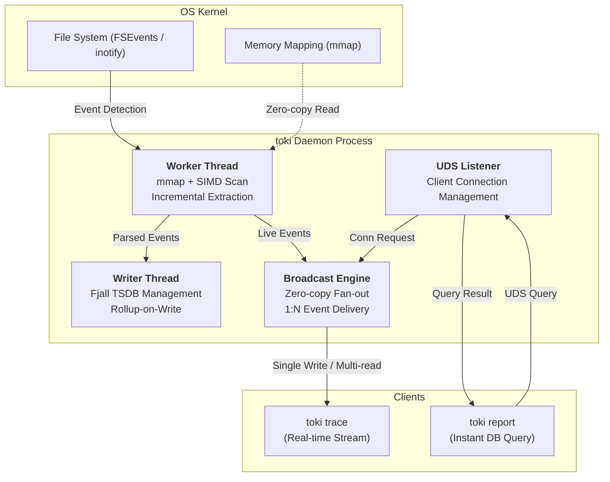
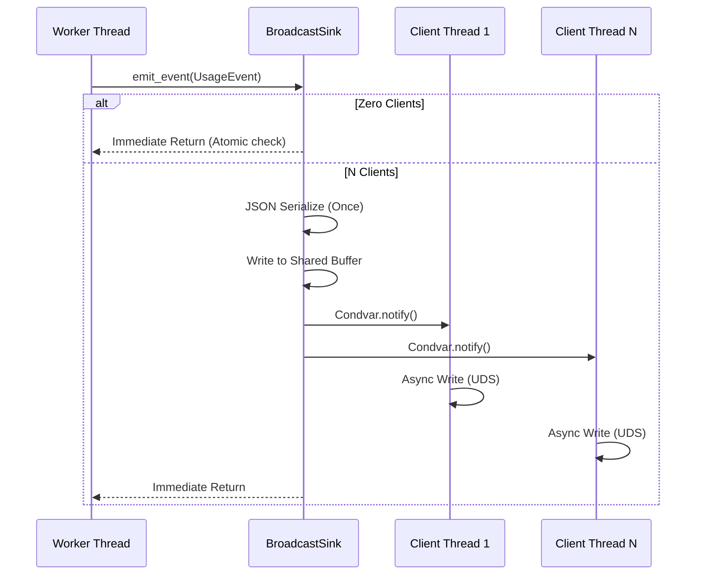

# toki Architecture & Design

This document details how `toki` achieves **Zero-Overhead** processing of large-scale token logs and maintains **Non-blocking** operation for the user through advanced systems engineering.

---

## 🏗 High-Level Architecture

`toki` employs a **Multi-threaded Daemon** architecture to ensure resource isolation and data integrity.

---

## ⚡️ I/O Innovation: Why toki is Non-blocking

While traditional tools use `read()` system calls—copying data from kernel to user space and looping through it—`toki` applies high-performance systems optimizations.

### 1. Zero-copy Reading via mmap
- Files are mapped directly into the process's address space (`mmap`), eliminating unnecessary memory copy overhead.
- Leveraging the OS page cache ensures that re-reading data incurs near-zero CPU cost.

### 2. SIMD (memchr) Accelerated Scanning
- Line-break (`\n`) detection is powered by **SIMD (Single Instruction, Multiple Data)** instructions rather than simple byte-loops.
- This allows scanning gigabytes of text at tens of GB/s, minimizing the time the CPU spends in log processing.

### 3. Smart Checkpoints with xxHash3
- Integrity is verified using the `xxHash3-64` algorithm at the last read position.
- By comparing both file size and content hashes, `toki` handles log rotations and manual edits gracefully, performing precise **Incremental Reads**.

---

## 📡 1:N Broadcasting: Zero-Overhead Design

The **Broadcast Engine** ensures that `toki trace` performance does not degrade regardless of the number of connected clients.

### Design Principles
1.  **Atomic Check (Zero Clients):** When no clients are connected, a single atomic integer check skips all logic. It is effectively a **No-op**.
2.  **Single Serialization:** JSON serialization is performed exactly **once**, whether there is one client or a hundred.
3.  **Condvar Fan-out:** Data is written to a shared buffer, and `Condvar::notify_all()` wakes all waiting client threads simultaneously.
4.  **Lock-free Reads:** Each client thread maintains its own queue, sending data asynchronously without blocking the main worker thread.

---

## 🗄 Data Layer: TSDB Optimization

`toki` stores data in `fjall`, an embedded time-series database.

### 1. Rollup-on-Write
- Hourly summaries are pre-calculated and stored at write time.
- Queries across months only need to scan a few hundred **Rollup** entries instead of millions of events, resulting in **7ms report speeds**.

### 2. Dictionary Compression
- Strings like model names (`claude-3-7-sonnet...`) and session IDs are compressed into integer IDs.
- This reduces disk footprint by over 80% and minimizes I/O pressure.

---

## 🧵 Threading Model (Thread Safety)

`toki` strictly separates roles to minimize lock contention:

- **Worker Thread:** Handles file system events and log parsing.
- **Writer Thread:** Exclusive owner of the DB to ensure sequential writes (prevents write stalls).
- **Listener Thread:** Manages UDS connections and incoming queries.
- **Notify Thread:** Low-level background thread receiving OS events (e.g., macOS FSEvents).

This precision engineering allows `toki` to unleash the full potential of hardware during **Cold Start** while remaining virtually invisible during **Watch Mode**.
