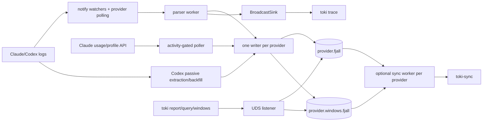

# toki architecture and design

This document describes the current implementation on the development branch.
Historical plans under `docs/archive/` are not runtime contracts.

## Process model

toki uses a daemon/client architecture on macOS and Linux. The CLI communicates
with the daemon over a Unix domain socket; it never opens a live fjall event DB
directly.


```mermaid
flowchart LR
    Logs[Claude/Codex logs] --> Watchers[notify watchers + provider polling]
    Watchers --> Worker[parser worker]
    Worker --> Writers[one writer per provider]
    Writers --> EventDB[(provider.fjall)]
    Worker --> Broadcast[BroadcastSink]
    Broadcast --> Trace[toki trace]

    ClaudeAPI[Claude usage/profile API] --> ClaudePoll[activity-gated poller]
    ClaudePoll --> Writers
    Logs --> CodexWindows[Codex passive extraction/backfill]
    CodexWindows --> Writers
    Writers --> WindowDB[(provider.windows.fjall)]

    CLI[toki report/query/windows] --> Listener[UDS listener]
    Listener --> EventDB
    Listener --> WindowDB

    EventDB --> Sync[optional sync worker per provider]
    WindowDB --> Sync
    Sync --> Server[toki-sync]
```

Thread count is intentionally dynamic rather than a fixed “four-thread”
contract:

- one event writer per enabled provider;
- one file-processing worker and notify-owned watcher threads;
- one UDS listener, plus connection handlers;
- two helper threads per connected trace client;
- optional per-provider sync workers;
- an optional Claude window poller and Codex window backfill worker.

There is no async runtime. Coordination uses `std::thread`, mutex/condvar state,
and bounded `crossbeam-channel` queues.

## Provider and platform boundaries

Provider-specific discovery and parsing implement traits in `src/providers/`.
Claude Code and Codex CLI are production providers. Both use append-oriented
JSONL but retain their own discovery rules and token-column semantics.

Platform services live behind `src/platform/mod.rs`:

- macOS: FSEvents, launchd auto-start;
- Linux: inotify, user systemd auto-start;
- Windows is not a supported build today because CLI/daemon IPC uses Unix
  domain socket APIs unconditionally.

Codex on macOS also uses a one-second stat-based poll because Codex can keep a
session fd open, delaying FSEvents notification until close. Providers that do
not need polling use a never-ready channel, so the worker has no poll tick.

## Ingestion and checkpoints

### Cold start

For each configured provider, the daemon discovers session files and scans them
in parallel with rayon. Parsed events are sent through a bounded channel to the
provider writer. A full initial scan is required to import history from before
toki was installed.

### Incremental watch

The worker receives filesystem notifications, checks file size, finds the last
processed line by reverse scanning for its length and xxHash3-64 fingerprint,
and parses only new complete lines. Checkpoints store the file path plus the
last-line length/hash, not a byte offset, so appended or compacted files can be
recovered without trusting a stale position.

Cold-start and watch writes use blocking channel sends. Backpressure slows the
parser instead of dropping usage data.

### Deduplication

Event keys begin with a big-endian millisecond timestamp. `idx_msg` maps a bare
message ID to its latest event key so streaming snapshots replace older values.
Codex event identity includes a per-event component so multiple usage events in
one message are not collapsed.

## Storage

Each provider has two fjall databases with different recovery properties.

### Rebuildable event DB

Path: `~/.config/toki/<provider>.fjall`

| Keyspace | Key/value role |
|----------|----------------|
| `checkpoints` | file path → `FileCheckpoint` |
| `meta` | schema version and internal markers |
| `events` | `[timestamp_ms BE][event identity]` → `StoredEvent` |
| `idx_sessions` | session-prefixed lookup keys |
| `idx_projects` | project-prefixed lookup keys |
| `dict` | string → compact numeric ID |
| `idx_msg` | bare message ID → latest event key |

There is no rollup keyspace and no rollup-on-write path. Summaries and calendar
groups scan the time-ordered event keyspace and accumulate into maps. Session or
project lists use their indexes when no time/project constraint requires an
event scan.

`SCHEMA_VERSION` protects the serialized event layout. A mismatch wipes only
this rebuildable DB and clears sync progress so provider logs are re-imported.

### Non-rebuildable window DB

Path: `~/.config/toki/<provider>.windows.fjall`

It contains a `windows` keyspace plus a `meta` keyspace with its independent
`WINDOWS_SCHEMA_VERSION`. Window identity is:

```text
[kind][limit_id_hash][account_hash][window_anchor_ms]
```

Window snapshots are versioned and merged field-by-field. A newer unknown
window schema is opened read-only: a downgraded daemon must not wipe or mutate
observations it cannot reconstruct. `toki daemon reset` therefore preserves
window DBs and settings while deleting event DBs.

## Rate-limit windows

`window_tracking` defaults to true.

- Codex observations are parsed inline from rollout logs. A background backfill
  scans 60 days on first use and rechecks eight days on later starts.
- Claude observations require its local credentials and usage/profile endpoint.
  Polling is activity-gated by Claude token writes and can be hot-disabled with
  `window_polling=false`.
- The tracker caps open identities, persists integer-percent/heartbeat changes,
  merges out-of-order observations, and derives finalized state after reset.
- Log-derived timestamps are clamped by wall clock before finalization so a
  future-skewed log line cannot close current windows early.

The UDS `WINDOWS` request powers `toki windows status`; `REPORT` with the
`windows` metric powers history, `toki query windows`, and remote sync output.

## Query paths

The listener accepts three protocol families:

- `TRACE` — stream event JSONL through `BroadcastSink`;
- `REPORT` — execute usage, cost, events, windows, sessions, or projects;
- `WINDOWS` — return per-provider live window state and optionally ask the
  Claude poller for bounded freshness.

Time bounds are parsed by `parse_range_time`. Supported local formats are
compact/dashed dates, compact date-times, Unix seconds, Unix milliseconds, and
RFC 3339/ISO 8601. Date-only end bounds resolve to the final millisecond of the
day. Reversed ranges are rejected before execution and at the UDS boundary.

`toki query` is the only free-form query command. It supports explicit
`--start`, `--end`, and `--step`; `toki report query` no longer exists. Local
grouping uses the query selector (`[1h]`, `[1d]`, `[1w]`, etc.). For remote
queries, an explicit step wins and otherwise a selector-derived step is sent.

Remote responses are normalized into the same sink types, but current server
limits remain visible architecture constraints: there is no cursor pagination,
very large results can be truncated, and server time parsing does not yet match
every local RFC 3339 form.

## Pricing

The daemon fetches LiteLLM pricing for live trace events. Report/query clients
fetch the same file cache unless `--no-cost` is active; remote queries use the
server-calculated cost as a fallback when local pricing is unavailable.

Resolution is exact-model first. Known Claude `-fast` variants can fall back to
base pricing multiplied by the provider's 2x fast table. If LiteLLM omits a
cache-read rate, toki uses the normal input rate rather than silently billing
cached input at zero. Missing cache-creation pricing remains zero because no
conservative provider-independent replacement is defined.

## Sync

Sync is opt-in. Each provider sync worker shares event and window uploads over
one persistent TCP/TLS connection. Events are batched, large batches are
zstd-compressed, and ACK progress is stored locally for reconnect/delta sync.
Settings are watched so enabling/disabling sync and toggling Claude window
polling take effect without restarting the daemon. Event/window retention
policies are captured at startup and require a restart.

Credentials use macOS Keychain on macOS and a permission-restricted JSON file
on Linux. Stable device identity lives at `~/.config/toki/device_id`.

The protocol dependency is pinned to `toki-sync-protocol` v1.1.0, which carries
the `SyncWindows`/`WireWindow` contract used by the daemon and sync server.

## Retention and recovery

- `retention_days=0` keeps event history indefinitely; a positive value deletes
  older events and matching indexes, then garbage-collects unused dictionary
  entries.
- `window_retention_days=730` is independent and runs even when event retention
  is disabled.
- Retention runs at startup and on the writer's daily tick.
- Stale open windows are finalized during retention independently of deletion.

## Configuration and network behavior

Priority is CLI override → `~/.config/toki/settings.json` → defaults.
`TOKI_HOME` can replace the home root for isolated execution; `TOKI_DEBUG`
controls diagnostic logging.

Parsing and local queries are local, but the daemon may make these outbound
requests:

- LiteLLM pricing fetch (report/query `--no-cost` skips the client operation;
  the daemon currently still fetches pricing at startup and trace only strips output);
- GitHub release update request (the daemon refreshes a local cache);
- activity-gated Claude usage/profile polling when enabled;
- configured toki-sync traffic when sync is enabled.

Prompts, responses, file contents, and thinking blocks are not stored in the
event DB or sent through sync. Stored/synced fields are token counts and routing
metadata such as model, provider, session, project, timestamp, and device.

## Backpressure and shutdown

The event/writer channel is bounded at 1024 operations. Event and checkpoint
sends block when full. Writer batches are committed at 64 events or a timed
flush.

Shutdown order stops listener intake, sync/backfill/poller workers, the file
worker, and finally provider writers. Remaining events, checkpoints, and open
window state are flushed before handles are joined. `Handle` also shuts down on
drop for library users.
